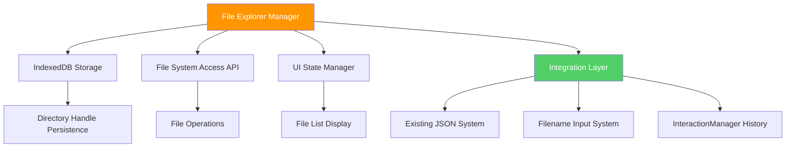
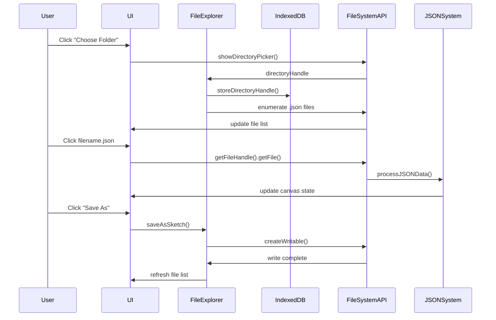

# File Explorer System Implementation Plan
**Enhanced Save/Load with IndexedDB Directory Persistence**

## Project Overview

We'll implement a comprehensive file explorer system that replaces the current basic save/load functionality with a directory-based file browser. This will allow users to:

1. **Choose a sketch directory once** - Browser remembers via IndexedDB
2. **Browse .json files** - Visual file list with click-to-load
3. **Save with context** - "Save" (overwrite) vs "Save As" (new file)  
4. **Persistent workflow** - Directory choice survives browser restarts

## System Architecture

### Core Components



### Data Flow



## Technical Implementation

### 1. IndexedDB Storage System

```javascript
// Core storage wrapper for directory handles
const DirectoryStorage = {
    DB_NAME: 'NetworkSketchpadFS',
    DB_VERSION: 1,
    STORE_NAME: 'directoryHandles',
    
    async openDB() {
        return new Promise((resolve, reject) => {
            const request = indexedDB.open(this.DB_NAME, this.DB_VERSION);
            
            request.onerror = () => reject(request.error);
            request.onsuccess = () => resolve(request.result);
            
            request.onupgradeneeded = (event) => {
                const db = event.target.result;
                if (!db.objectStoreNames.contains(this.STORE_NAME)) {
                    db.createObjectStore(this.STORE_NAME);
                }
            };
        });
    },
    
    async storeHandle(key, handle) {
        const db = await this.openDB();
        const transaction = db.transaction([this.STORE_NAME], 'readwrite');
        const store = transaction.objectStore(this.STORE_NAME);
        return store.put(handle, key);
    },
    
    async getHandle(key) {
        const db = await this.openDB();
        const transaction = db.transaction([this.STORE_NAME], 'readonly');
        const store = transaction.objectStore(this.STORE_NAME);
        return store.get(key);
    }
};
```

### 2. File Explorer Manager

```javascript
const FileExplorerManager = {
    directoryHandle: null,
    currentFilename: null,
    files: [],
    
    async init() {
        await this.loadStoredDirectory();
        this.updateUI();
        this.attachEventListeners();
    },
    
    async chooseDirectory() {
        if (!('showDirectoryPicker' in window)) {
            throw new Error('File System Access API not supported');
        }
        
        const handle = await window.showDirectoryPicker({ mode: 'readwrite' });
        await DirectoryStorage.storeHandle('sketchDirectory', handle);
        this.directoryHandle = handle;
        await this.refreshFileList();
    },
    
    async loadStoredDirectory() {
        try {
            const handle = await DirectoryStorage.getHandle('sketchDirectory');
            if (handle && await this.verifyPermissions(handle)) {
                this.directoryHandle = handle;
                await this.refreshFileList();
                return true;
            }
        } catch (error) {
            console.log('No stored directory or permission denied:', error);
        }
        return false;
    },
    
    async verifyPermissions(handle) {
        const permission = await handle.queryPermission({ mode: 'readwrite' });
        if (permission === 'granted') return true;
        if (permission === 'prompt') {
            const newPermission = await handle.requestPermission({ mode: 'readwrite' });
            return newPermission === 'granted';
        }
        return false;
    },
    
    async refreshFileList() {
        if (!this.directoryHandle) {
            this.files = [];
            this.updateUI();
            return;
        }
        
        try {
            this.files = [];
            for await (const [name, handle] of this.directoryHandle.entries()) {
                if (handle.kind === 'file' && name.endsWith('.json')) {
                    this.files.push({ name, handle });
                }
            }
            this.files.sort((a, b) => a.name.localeCompare(b.name));
            this.updateUI();
        } catch (error) {
            console.error('Failed to read directory:', error);
            this.directoryHandle = null;
            this.files = [];
            this.updateUI();
        }
    }
};
```

### 3. UI Component Updates

**HTML Structure (replaces current actionbuttonbox):**

```html
<div id="actionbuttonbox">
    <!-- Filename input (existing) -->
    <div style="margin-bottom: 8px;">
        <label for="filenameInput" style="display: block; margin-bottom: 4px; font-size: 11px; color: #333;">
            Filename on save:
        </label>
        <div style="display: flex; align-items: center; gap: 2px;">
            <input type="text" id="filenameInput" placeholder="sketch_name" value=""
                   style="flex: 1; padding: 6px; border: 1px solid #ccc; border-radius: 3px; font-size: 11px; box-sizing: border-box; font-family: inherit;">
            <span style="font-size: 11px; color: #666; font-family: inherit;">.json</span>
        </div>
    </div>

    <!-- NEW: File Explorer Section -->
    <div id="file-explorer-section" style="margin-bottom: 8px;">
        <div style="display: flex; align-items: center; justify-content: space-between; margin-bottom: 4px;">
            <label style="font-size: 11px; color: #333; font-weight: bold;">Sketch Directory:</label>
            <button onclick="chooseSketchDirectory()" class="primary-button" style="padding: 4px 8px; font-size: 10px;">
                Choose Folder
            </button>
        </div>
        
        <div id="directory-status" style="font-size: 10px; color: #666; margin-bottom: 6px; min-height: 12px;">
            No directory selected
        </div>
        
        <div id="file-list" style="
            max-height: 120px; 
            overflow-y: auto; 
            border: 1px solid #ddd; 
            border-radius: 3px; 
            background: white;
            display: none;
        "></div>
    </div>

    <!-- NEW: Enhanced Save Options -->
    <div style="display: flex; gap: 4px; margin-bottom: 4px;">
        <button onclick="saveCurrentFile()" class="primary-button" style="flex: 1; font-size: 11px;" disabled id="save-btn">
            Save
        </button>
        <button onclick="saveAsNewFile()" class="primary-button" style="flex: 1; font-size: 11px;" disabled id="save-as-btn">
            Save As
        </button>
    </div>

    <!-- Legacy fallback (existing functionality) -->
    <div style="border-top: 1px solid #ddd; padding-top: 8px; margin-top: 8px;">
        <label for="jsonFileInput" class="primary-button file-button" style="font-size: 11px;">Load from File</label>
        <input type="file" id="jsonFileInput" accept=".json" onchange="importFromJSON(this)" style="display: none;">
    </div>

    <button onclick="clearCanvas()" class="danger-button">Clear Sketch</button>
</div>
```

### 4. Integration with Existing Systems

**Connection Points:**

1. **JSON Processing**: Use existing `processJSONData()` function
2. **Filename System**: 
   - "Save": Use `this.currentFilename` from loaded file
   - "Save As": Use `getCustomFilename()` from input field or prompt user
3. **History System**: **SEPARATE** from file operations - only tracks canvas edits
4. **Error Handling**: Consistent with existing error patterns

**History System Separation:**
- File operations (load/save) do NOT interact with canvas history
- Loading a file clears history and establishes new baseline
- History only tracks canvas edits between file load and save
- Canvas editing begins fresh after each file load

```javascript
// File loading integration - NO history interaction
async loadFile(filename) {
    try {
        const fileData = this.files.find(f => f.name === filename);
        if (!fileData) throw new Error(`File ${filename} not found`);
        
        const file = await fileData.handle.getFile();
        const content = await file.text();
        const jsonData = JSON.parse(content);
        
        // Use existing JSON processing system
        processJSONData(jsonData, filename);
        
        // Update current file tracking
        this.currentFilename = filename;
        this.updateFilenameInput(filename);
        this.updateUI();
        
        // CRITICAL: Clear canvas history and establish new baseline
        if (canvasHistory) {
            canvasHistory.timeline = [];
            canvasHistory.cursor = -1;
            canvasHistory.pending = null;
            // Push initial state as new baseline
            canvasHistory.push(canvasHistory.serializeCurrentState());
        }
        
    } catch (error) {
        console.error('Failed to load file:', error);
        alert(`Failed to load ${filename}: ${error.message}`);
    }
}

// Save operations - NO history interaction
async saveCurrentFile() {
    // Save using this.currentFilename (overwrite loaded file)
    const filename = this.currentFilename || (getCustomFilename().replace('.json', '') + '.json');
    await this.saveToFile(filename.replace('.json', ''));
}

async saveAsNewFile() {
    // Save As using filename input or user prompt
    const suggestedName = getCustomFilename().replace('.json', '');
    if (suggestedName) {
        await this.saveToFile(suggestedName);
    }
}
```

### 5. Browser Compatibility Strategy

```javascript
// Feature detection and graceful degradation
const FileSystemSupport = {
    isSupported() {
        return 'showDirectoryPicker' in window;
    },
    
    showUnsupportedMessage() {
        const statusEl = document.getElementById('directory-status');
        statusEl.innerHTML = `
            <div style="color: #f44336; font-weight: bold;">
                ⚠️ File System Access API not supported
            </div>
            <div style="font-size: 9px; margin-top: 2px;">
                Please use Chrome/Edge for directory features
            </div>
        `;
    },
    
    init() {
        if (!this.isSupported()) {
            this.showUnsupportedMessage();
            document.getElementById('file-list').style.display = 'none';
            document.querySelector('#file-explorer-section button').disabled = true;
            return false;
        }
        return true;
    }
};
```

## Implementation Phases

### Phase 1: Core Infrastructure ✅ Planned
- IndexedDB wrapper functions
- Directory handle storage/retrieval
- Permission verification system

### Phase 2: File System Integration ✅ Planned  
- Directory picker implementation
- File enumeration and filtering
- Read/write operations with error handling

### Phase 3: UI Implementation ✅ Planned
- HTML structure updates
- File list rendering
- Button state management
- Visual feedback systems

### Phase 4: Integration & Testing ✅ Planned
- Connect to existing JSON system
- Filename input integration
- History system connection
- Browser compatibility handling
- Error scenario testing

## Expected Benefits

1. **Improved Workflow**: No more hunting for files in browser downloads
2. **Better Organization**: Users can organize sketches in meaningful directories
3. **Persistent Context**: Browser remembers workspace across sessions
4. **Professional UX**: File explorer feels like desktop application
5. **Backward Compatibility**: Existing functionality remains as fallback
6. **Clean History**: Each file load starts fresh history tracking
7. **Flexible Saving**: "Save" (overwrite) vs "Save As" (new file) workflow

## Risk Mitigation

1. **Browser Support**: Graceful fallback for unsupported browsers
2. **Permission Issues**: Clear error messages and re-prompt mechanisms  
3. **File Conflicts**: Confirmation dialogs for overwrite operations
4. **IndexedDB Issues**: Error handling for storage quota/corruption
5. **Migration Path**: Existing workflows continue to work unchanged
6. **History Separation**: File operations isolated from canvas editing history

## Key Design Principles

### File Operations vs Canvas Editing Separation
- **File Operations**: Load, Save, Save As - these are external to canvas editing
- **Canvas Editing**: Node creation, text editing, dragging - these use history system
- **History Boundary**: Loading a file clears history and establishes new baseline
- **Clean Workflow**: Load file → Edit canvas → Save file (history tracks only the editing phase)

### Save Functionality Clarification
- **"Save" Button**: Overwrites the currently loaded file (`this.currentFilename`)
- **"Save As" Button**: Uses `getCustomFilename()` from input field or prompts user for new name
- **First Save**: If no file loaded, "Save" acts like "Save As"

This plan provides a robust foundation for implementing the file explorer system while maintaining strict separation between file management and canvas editing operations, ensuring a clean and predictable user experience.
