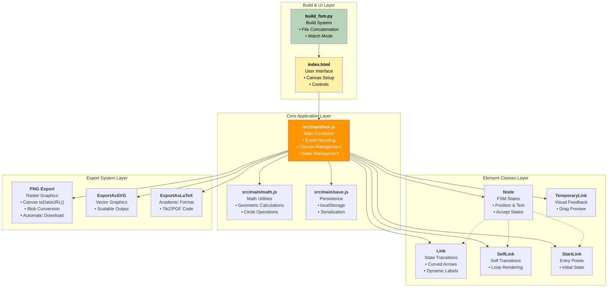
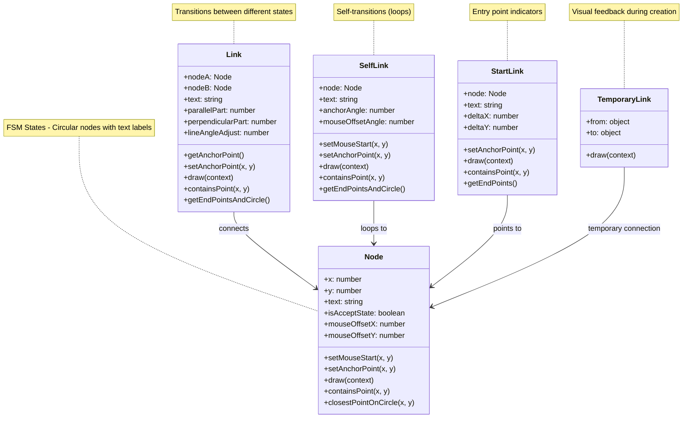
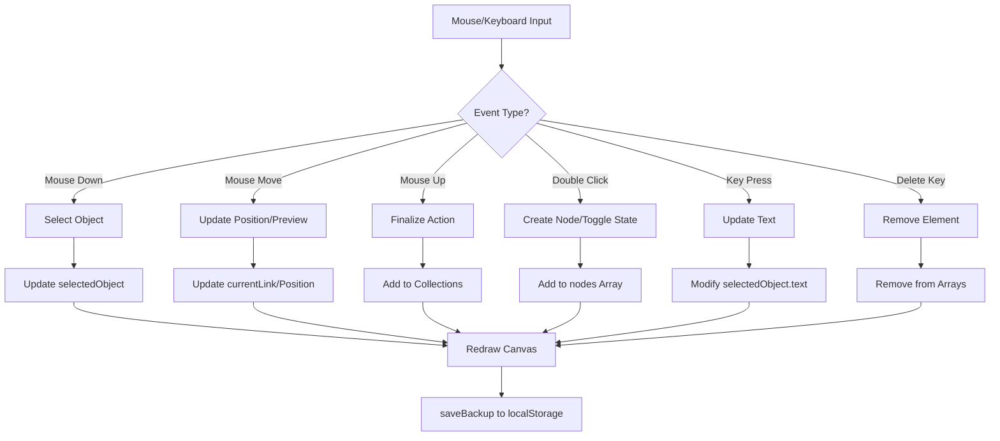
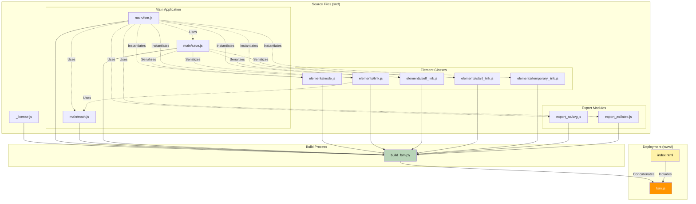

# Finite State Machine Designer - Architecture Overview

## Table of Contents

1. [Project Summary](#project-summary)
2. [Technology Stack](#technology-stack)
3. [Architecture Overview](#architecture-overview)
   - [Core Application (`src/main/fsm.js`)](#1-core-application-srcmainfjsjs)
   - [Element Classes (`src/elements/`)](#2-element-classes-srcelements)
   - [Export System (`src/export_as/`)](#3-export-system-srcexport_as)
   - [Build System (`build_fsm.py`)](#4-build-system-buildpy)
   - [User Interface (`www/index.html`)](#5-user-interface-wwwindexhtml)
4. [Data Flow](#data-flow)
5. [Development Workflow](#development-workflow)
6. [Implementation Details for Code Modification](#implementation-details-for-code-modification)
   - [Key Design Patterns](#key-design-patterns)
   - [Global State Management](#global-state-management)
   - [Event Handling Architecture](#event-handling-architecture)
   - [Rendering Pipeline](#rendering-pipeline)
   - [Coordinate System and Hit Detection](#coordinate-system-and-hit-detection)
   - [Text Processing System](#text-processing-system)
   - [Persistence Mechanism](#persistence-mechanism)
   - [Export System Implementation](#export-system-implementation)
   - [Build System Mechanics](#build-system-mechanics)
   - [Browser Compatibility Layer](#browser-compatibility-layer)
   - [Memory Management](#memory-management)
   - [Mathematical Foundations](#mathematical-foundations)
   - [State Validation](#state-validation)
7. [File-by-File Breakdown](#file-by-file-breakdown)
   - [Build System](#build-system)
   - [Core Application Files](#core-application-files)
   - [Element Classes](#element-classes-1)
   - [Export System](#export-system-1)
   - [Web Interface](#web-interface)

## Project Summary
A web-based interactive finite state machine designer that allows users to create, edit, and export FSM diagrams. This is a single-page application built with vanilla JavaScript and HTML5 Canvas, originally created by Evan Wallace and forked for enhancements.

## Technology Stack
- **Frontend**: Vanilla JavaScript, HTML5 Canvas, CSS3
- **Build System**: Python-based concatenation script
- **Development Server**: Python HTTP server
- **No Dependencies**: Pure client-side application with no external libraries

## Architecture Overview



### 1. Core Application (`src/main/fsm.js`)
The main application controller that orchestrates the entire FSM designer:

- **Canvas Management**: Handles HTML5 Canvas setup, drawing, and rendering
- **Event Handling**: Mouse and keyboard interaction management
- **State Management**: Maintains collections of nodes and links
- **User Interface**: Implements drawing, selection, and editing workflows
- **Export Coordination**: Interfaces with export modules

Key responsibilities:
- Mouse event handling (click, drag, move)
- Keyboard input processing (text entry, shortcuts)
- Selection and manipulation of FSM elements
- Rendering loop and visual feedback
- Cross-browser compatibility utilities

### 2. Element Classes (`src/elements/`)
Object-oriented design with specialized classes for each FSM component:

#### **Node (`node.js`)**
- Represents FSM states as circles with position (x,y), text labels, and accept state flags
- Handles drawing, hit detection, and positioning methods including double circle rendering for accept states
- Key members: `x`, `y`, `text`, `isAcceptState`, `draw()`, `containsPoint()`, `closestPointOnCircle()`, `setAnchorPoint()`

#### **Link (`link.js`)**
- Represents transitions between different states with curved arrow rendering and dynamic label placement
- Performs mathematical calculations for arc geometry and interactive curve manipulation
- Key members: `nodeA`, `nodeB`, `text`, `parallelPart`, `perpendicularPart`, `draw()`, `containsPoint()`, `getEndPointsAndCircle()`

#### **SelfLink (`self_link.js`)**
- Self-transitions that loop back to the same state with specialized circular arc rendering
- Manages anchor point positioning for loop placement and geometry
- Key members: `node`, `text`, `anchorAngle`, `draw()`, `containsPoint()`, `getEndPointsAndCircle()`, `setAnchorPoint()`

#### **StartLink (`start_link.js`)**
- Entry point indicator for FSM that points to the initial state with simple arrow rendering
- Provides start state visualization without requiring a source node
- Key members: `node`, `text`, `deltaX`, `deltaY`, `draw()`, `containsPoint()`, `getEndPoints()`, `setAnchorPoint()`

#### **TemporaryLink (`temporary_link.js`)**
- Visual feedback during link creation with real-time preview while dragging
- Converts to permanent link types upon completion of user operations
- Key members: `from`, `to`, `draw()` (simplified interface for temporary rendering)



### 3. Export System (`src/export_as/`)
Pluggable export architecture using the Strategy pattern:

#### **SVG Export (`svg.js`)**
- `ExportAsSVG` class mimics Canvas2D API to generate scalable vector graphics with preserved visual fidelity
- Outputs standards-compliant SVG markup for web and print applications
- Key members: `toSVG()`, `arc()`, `stroke()`, `fill()`, `fillText()`, `measureText()`, `_svgData`, `_transX`, `_transY`

#### **LaTeX Export (`latex.js`)**
- `ExportAsLaTeX` class implements Canvas2D interface to generate TikZ/PGF code for academic publications  
- Handles coordinate system transformation and produces publication-ready LaTeX documents
- Key members: `toLaTeX()`, `arc()`, `stroke()`, `fill()`, `advancedFillText()`, `measureText()`, `_texData`, `_scale`

### 4. Build System (`build_fsm.py`)
Simple Python-based build pipeline:
- **File Concatenation**: Combines all source files into single `www/built-fsm.js`
- **Watch Mode**: Monitors source changes for development
- **No Minification**: Preserves readable code for debugging

### 5. User Interface (`www/index.html`)
Minimalist single-page application:
- **Responsive Design**: Canvas auto-resizes to viewport
- **Embedded Styles**: All CSS contained in HTML
- **Control Panel**: Floating help text and export links
- **Accessibility**: Keyboard navigation and focus management

## Key Design Patterns

### 1. **Strategy Pattern**
Export functionality uses strategy pattern with Canvas2D API mimicry:
```javascript
// Same drawing code works for canvas, SVG, and LaTeX
function draw() {
    drawUsing(canvas.getContext('2d'));     // Screen rendering
    drawUsing(new ExportAsSVG());           // SVG export
    drawUsing(new ExportAsLaTeX());         // LaTeX export
}
```

### 2. **Observer Pattern**
Canvas automatically redraws when model changes:
- State changes trigger `draw()` calls
- Visual feedback updates in real-time
- Separation of model and view concerns

### 3. **Factory Pattern**
Dynamic creation of links based on user interaction:
- Mouse state determines link type
- Temporary links convert to permanent ones
- Context-sensitive object instantiation

## Data Flow

### 1. **User Interaction Flow**


### 2. **Element Creation Flow**
```mermaid
flowchart TD
    A[User Action] --> B{Action Type?}
    
    B -->|Double-click Empty Space| C[Create Node]
    B -->|Shift + Drag| D[Create Link]
    
    C --> C1[new Node(x, y)]
    C1 --> C2[nodes.push(node)]
    C2 --> C3[selectedObject = node]
    
    D --> D1{Drag State?}
    D1 -->|Start Drag| D2[Create TemporaryLink]
    D1 -->|During Drag| D3[Update TemporaryLink]
    D1 -->|End Drag| D4{Target Found?}
    
    D4 -->|Yes - Node| D5[Create Link/SelfLink/StartLink]
    D4 -->|No| D6[Discard TemporaryLink]
    
    D5 --> D7[links.push(link)]
    D7 --> D8[selectedObject = link]
    
    C3 --> E[draw()]
    D8 --> E
    D6 --> E
    
    E --> F[saveBackup()]
```

### 3. **Export Process Flow**
```mermaid
flowchart TD
    A[Export Request] --> B{Export Type?}
    
    B -->|PNG| C[Canvas toDataURL]
    B -->|SVG| D[Create ExportAsSVG]
    B -->|LaTeX| E[Create ExportAsLaTeX]
    
    C --> C1[Convert to Blob]
    C1 --> C2[Create Download Link]
    C2 --> C3[Trigger Download]
    C3 --> C4[Cleanup Resources]
    
    D --> F[Clear Selection]
    E --> F
    
    F --> G[drawUsing(exportObject)]
    G --> H[Replay All Draw Calls]
    H --> I{Export Type?}
    
    I -->|SVG| J[Generate SVG Markup]
    I -->|LaTeX| K[Generate TikZ Code]
    
    J --> L[Output SVG Document]
    K --> M[Output LaTeX Document]
    
    L --> N[Display in Textarea]
    M --> N
```

### Export Formats
- **PNG**: Raster image via Canvas.toDataURL(), converted to blob for proper file download
- **SVG**: Vector graphics for web and print
- **LaTeX**: Academic publication integration


### Extensibility
- Modular architecture enables easy feature addition
- Plugin-style export system
- Clean separation between UI and business logic

## Development Workflow

### Build Process
```bash
python3 build_fsm.py                # One-time build
python3 build_fsm.py --watch        # Development mode
```

### Local Development
```bash
python3 -m http.server 8000     # Start dev server
# Navigate to http://localhost:8000
```

### File Organization
- Source files in `src/` for modularity
- Built file in `www/built-fsm.js` for deployment
- Single HTML file for easy hosting



This architecture demonstrates clean separation of concerns, extensible design patterns, and thoughtful user experience considerations while maintaining simplicity and performance.

## Data Flow

## Implementation Details for Code Modification

### Build System

#### `build_fsm.py`
This Python script serves as the project's build system, recursively scanning the `src/` directory to concatenate all JavaScript files into a single `www/built-fsm.js` file. The script supports watch mode for development, automatically rebuilding when source files change. It enables modular development while deploying as a single file with no runtime dependencies.

### Core Application Files

#### `src/main/fsm.js`
The primary application controller orchestrates the entire FSM designer through comprehensive event handling and canvas management. This file implements mouse and keyboard interaction logic, maintains collections of nodes and links, and coordinates the rendering pipeline. It instantiates all element classes from `src/elements/`, integrates with export modules from `src/export_as/`, and utilizes mathematical utilities from `src/main/math.js` while managing persistence through `src/main/save.js`.

#### `src/main/math.js`
A utility module providing mathematical functions essential for geometric calculations throughout the application. The module handles coordinate transformations, distance calculations, and circle geometry operations required for FSM element positioning and rendering. It serves hit detection logic in `src/main/fsm.js` and supports curved link calculations across all element classes.

#### `src/main/save.js`
This module manages persistence and serialization functionality, handling automatic saving of FSM diagrams to browser localStorage and restoration on page load. It works directly with Node and Link objects to serialize their state and integrates seamlessly with the browser's localStorage API, being called by `src/main/fsm.js` for backup and restore operations.

### Element Classes

#### `src/elements/node.js`
Represents FSM states as interactive circular nodes with comprehensive rendering capabilities including text labels and accept state visualization through double circles. The class handles hit detection and mouse interaction for individual nodes while being instantiated and managed by `src/main/fsm.js`. All link classes reference Node instances as connection endpoints, and export modules call its rendering methods for format-specific output.

#### `src/elements/link.js`
Implements transitions between different states through sophisticated curved arrow rendering and dynamic label positioning. The class performs complex mathematical arc calculations for interactive curve manipulation while referencing Node instances for source and target states. It utilizes mathematical functions from `src/main/math.js` and shares rendering patterns with other link types, being called by `src/main/fsm.js` for rendering and hit detection.

#### `src/elements/self_link.js`
Handles self-transitions that loop back to the same state through specialized circular arc rendering and anchor point management. The class references a single Node instance for the looping state and follows similar patterns to `src/elements/link.js` while implementing specialized geometry. It's managed by `src/main/fsm.js` event handling and utilizes shared drawing utilities and constants.

#### `src/elements/start_link.js`
Provides entry point visualization through simple arrow rendering that points to the FSM's initial state without requiring a source node. The class references a single Node instance as its target and is created and managed by `src/main/fsm.js` while using shared arrow drawing functions with simpler geometry compared to other link types.

#### `src/elements/temporary_link.js`
Delivers real-time visual feedback during link creation by showing temporary links while users drag to create new transitions. This class is created temporarily by `src/main/fsm.js` during mouse drag operations and converts to permanent link types when operations complete. It uses similar rendering logic to other link classes but is never persisted or saved.

### Export System

#### `src/export_as/svg.js`
Implements SVG export functionality through a Canvas2D-compatible API that generates SVG markup instead of drawing to canvas. The module handles coordinate conversion, path generation, and text rendering while mimicking the Canvas2D API used by `src/main/fsm.js` drawing code. It works with all element classes through their draw() methods and generates standalone SVG documents when called by export functions.

#### `src/export_as/latex.js`
Provides LaTeX/TikZ export capabilities through a Canvas2D-compatible API that generates TikZ/PGF code for academic documents. The module handles coordinate scaling, academic formatting, and mathematical notation while mimicking the same Canvas2D API structure. It works with all element classes through their draw() methods and produces complete LaTeX documents ready for compilation when invoked by export functions.

### Web Interface

#### `www/index.html`
Serves as the single-page application entry point containing all HTML structure, embedded CSS styles, base64 utilities, and canvas setup code. The file includes the compiled `www/built-fsm.js` generated by `build_fsm.py` and provides DOM elements referenced by `src/main/fsm.js`. It handles initial page load, responsive canvas sizing, and hosts the canvas element used for all rendering operations.

#### `src/_license.js`
Contains copyright notices, license text, and attribution information for the original work, being included at the top of the compiled `www/built-fsm.js` file. This file serves purely informational purposes with no runtime functionality, ensuring proper attribution in distributed code.

## Implementation Details for Code Modification

### Key Design Patterns

#### 1. **Strategy Pattern**
Export functionality uses strategy pattern with Canvas2D API mimicry:
```javascript
// Same drawing code works for canvas, SVG, and LaTeX
function draw() {
    drawUsing(canvas.getContext('2d'));     // Screen rendering
    drawUsing(new ExportAsSVG());           // SVG export
    drawUsing(new ExportAsLaTeX());         // LaTeX export
}
```

#### 2. **Observer Pattern**
Canvas automatically redraws when model changes:
- State changes trigger `draw()` calls
- Visual feedback updates in real-time
- Separation of model and view concerns

#### 3. **Factory Pattern**
Dynamic creation of links based on user interaction:
- Mouse state determines link type
- Temporary links convert to permanent ones
- Context-sensitive object instantiation

### Global State Management
The application maintains global state through several key variables in `src/main/fsm.js`:
- `nodes[]` - Array containing all Node instances on the canvas
- `links[]` - Array containing all Link instances (including SelfLink, StartLink types)
- `selectedObject` - Currently selected element (Node or Link), null if none selected
- `currentLink` - Temporary link being created during drag operations
- `canvas` - HTML5 Canvas element reference
- `nodeRadius` - Constant defining node circle radius (30 pixels)

### Event Handling Architecture
Mouse events are handled through direct canvas event listeners with cross-browser compatibility functions:
- `canvas.onmousedown` - Initiates selection, movement, or link creation
- `canvas.onmousemove` - Handles dragging and real-time feedback
- `canvas.onmouseup` - Completes operations and finalizes links
- `canvas.ondblclick` - Creates new nodes or toggles accept states

Keyboard events use document-level listeners with focus management:
- Text input directly modifies `selectedObject.text` when element has focus
- Delete key removes selected elements and associated connections
- Shift key enables link creation mode during mouse operations

### Rendering Pipeline
The drawing system uses a consistent pattern across all elements:
1. `draw()` function calls `drawUsing(canvas.getContext('2d'))`
2. Each element implements a `draw(context)` method accepting Canvas2D or export context
3. Visual styling is applied through context properties (strokeStyle, fillStyle, lineWidth)
4. Text rendering uses `drawText()` utility with LaTeX shortcut conversion

### Coordinate System and Hit Detection
Canvas uses standard pixel coordinates with (0,0) at top-left. Hit detection employs geometric calculations:
- Nodes use circular hit areas with `containsPoint(x, y)` methods
- Links calculate distance from point to curve using mathematical approximations
- Snap-to-grid functionality uses `snapToPadding` constant for alignment assistance

### Text Processing System
Text input supports mathematical notation through conversion functions:
- Greek letters: `\alpha`, `\beta`, etc. converted to Unicode characters
- Subscripts: `_0`, `_1`, etc. converted to Unicode subscript characters
- `convertLatexShortcuts()` handles real-time text transformation
- `textToXML()` escapes text for SVG/LaTeX export compatibility

### Persistence Mechanism
State persistence uses browser localStorage with automatic backup:
- `saveBackup()` serializes nodes and links arrays to JSON
- `restoreBackup()` deserializes and recreates object instances on page load
- Backup occurs automatically after each state change
- No server-side storage; entirely client-side persistence

### Export System Implementation
Export modules implement different strategies for generating output:
- **PNG Export**: Uses Canvas.toDataURL() to generate base64 data, converts to blob, and triggers browser download via temporary anchor element with download attribute
- **SVG Export**: `ExportAsSVG` captures drawing calls and generates SVG elements through Canvas2D API mimicry
- **LaTeX Export**: `ExportAsLaTeX` converts Canvas operations to TikZ commands through Canvas2D API mimicry
- SVG and LaTeX classes maintain internal state tracking for coordinate transformation
- Export process: clear selection → draw using export context → generate output

### Build System Mechanics
The Python build script operates through simple file concatenation:
- Recursively scans `src/` directory for `.js` files
- Concatenates files in filesystem order (no dependency resolution)
- Outputs single `www/built-fsm.js` file overwriting previous version
- Watch mode polls file modification times every 500ms

### Browser Compatibility Layer
Cross-browser support implemented through utility functions:
- `crossBrowserKey()` normalizes keyCode/which across browsers
- `crossBrowserMousePos()` handles different mouse position APIs
- `crossBrowserRelativeMousePos()` calculates canvas-relative coordinates
- Base64 encoding polyfill for older browsers lacking btoa()

### Memory Management
The application manages object lifecycle through array manipulation:
- Element deletion removes objects from global arrays and nullifies references
- No explicit memory cleanup; relies on JavaScript garbage collection
- Temporary objects (TemporaryLink) are replaced rather than modified
- Canvas redraws clear previous frame completely

### Mathematical Foundations
Geometric calculations rely on standard mathematical functions:
- Circle intersection algorithms for curved link rendering
- Angle calculations for arrow positioning and text placement
- Distance formulas for hit detection and snap-to-grid functionality
- Coordinate transformation for different export coordinate systems

### State Validation
The application maintains consistency through implicit validation:
- Link deletion cascades to remove associated connections
- Node deletion removes all connected links automatically
- Accept state toggling preserved during serialization/deserialization
- No explicit validation layer; state consistency enforced through operational logic


### Build System

#### `build_fsm.py`