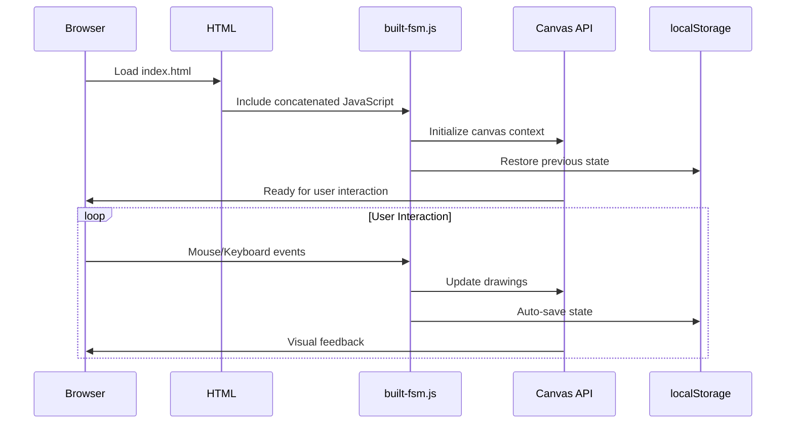
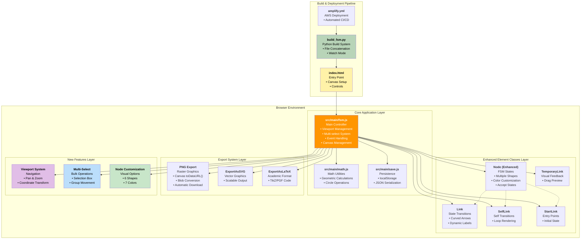
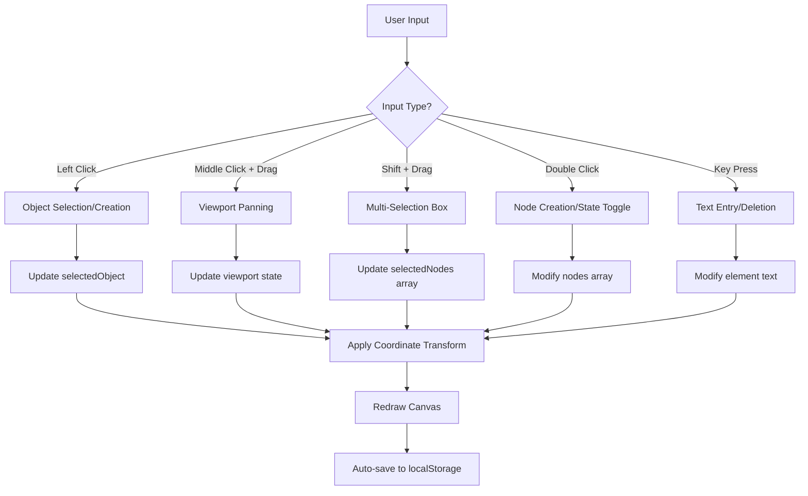

# Network Sketchpad - Architecture Context Summary
*Generated: October 12, 2025*

## Table of Contents

1. [Project Overview & Browser Execution Model](#project-overview--browser-execution-model)
2. [High-Level System Architecture](#high-level-system-architecture)
3. [Component Relationships & Data Flow](#component-relationships--data-flow)
4. [Detailed Implementation Analysis](#detailed-implementation-analysis)
   - [4.1 Core Application Controller](#41-core-application-controller)
   - [4.2 Element Class System](#42-element-class-system)
   - [4.3 Export Strategy Pattern](#43-export-strategy-pattern)
   - [4.4 Event Handling & State Management](#44-event-handling--state-management)
   - [4.5 Mathematical & Geometric Foundations](#45-mathematical--geometric-foundations)
5. [Technical Infrastructure](#technical-infrastructure)
   - [5.1 Build & Deployment Pipeline](#51-build--deployment-pipeline)
   - [5.2 File-by-File Implementation Guide](#52-file-by-file-implementation-guide)
6. [Development Workflow & Extension Points](#development-workflow--extension-points)

## Project Overview & Browser Execution Model

### Core Concept
Network Sketchpad is a sophisticated client-side finite state machine (FSM) designer that leverages the HTML5 Canvas API to provide an interactive drawing environment entirely within the browser. Originally created by Evan Wallace, this fork has been significantly enhanced with advanced navigation, multi-selection capabilities, and extended customization features.

### Browser Execution Flow


The application executes as a pure client-side solution with zero external dependencies, making it extremely portable and fast to load.

## High-Level System Architecture



## Function & Class Dependency DAG

This detailed diagram shows the specific function and method dependencies between modules, revealing the intricate relationships within the codebase:

```mermaid
graph TD
    subgraph "Core Functions (src/main/fsm.js)"
        DRAW_TEXT["`**drawText()**
        Text Rendering
        • LaTeX conversion
        • Font styling`"]
        DRAW_ARROW["`**drawArrow()**
        Arrow Drawing
        • Geometric angles
        • Canvas paths`"]
        CONVERT_LATEX["`**convertLatexShortcuts()**
        Text Processing
        • Greek letters
        • Subscripts`"]
        TEXT_XML["`**textToXML()**
        XML Escaping
        • Export safety`"]
        SELECT_OBJECT["`**selectObject()**
        Hit Detection
        • Object picking`"]
        DRAW_USING["`**drawUsing()**
        Main Render
        • Viewport transform`"]
    end

    subgraph "Math Utilities (src/main/math.js)"
        DET["`**det()**
        Determinant
        • Matrix calculation`"]
        CIRCLE_THREE["`**circleFromThreePoints()**
        Circle Geometry
        • Arc calculations`"]
        FIXED["`**fixed()**
        Number Formatting
        • Export precision`"]
    end

    subgraph "Persistence Layer (src/main/save.js)"
        SAVE_BACKUP["`**saveBackup()**
        State Serialization
        • JSON conversion
        • localStorage write`"]
        RESTORE_BACKUP["`**restoreBackup()**
        State Restoration
        • Object reconstruction
        • localStorage read`"]
    end

    subgraph "Node Class Methods (src/elements/node.js)"
        NODE_DRAW["`**Node.draw()**
        Shape Rendering
        • Multiple shapes
        • Color system`"]
        NODE_CONTAINS["`**Node.containsPoint()**
        Hit Testing
        • Shape-specific`"]
        NODE_CLOSEST["`**Node.closestPointOnCircle()**
        Geometry Helper
        • Link connections`"]
        NODE_COLORS["`**Node.getBaseColor()**
        **Node.getSelectedColor()**
        Color Management`"]
    end

    subgraph "Link Class Methods (src/elements/link.js)"
        LINK_DRAW["`**Link.draw()**
        Arc Rendering
        • Curved arrows`"]
        LINK_ENDPOINTS["`**Link.getEndPointsAndCircle()**
        Geometry Calculation
        • Complex math`"]
        LINK_CONTAINS["`**Link.containsPoint()**
        Hit Detection
        • Arc geometry`"]
        LINK_ANCHOR["`**Link.getAnchorPoint()**
        **Link.setAnchorPoint()**
        Position Management`"]
    end

    subgraph "SelfLink Class Methods (src/elements/self_link.js)"
        SELF_DRAW["`**SelfLink.draw()**
        Loop Rendering`"]
        SELF_ENDPOINTS["`**SelfLink.getEndPointsAndCircle()**
        Circle Geometry`"]
        SELF_CONTAINS["`**SelfLink.containsPoint()**
        Hit Detection`"]
    end

    subgraph "StartLink Class Methods (src/elements/start_link.js)"
        START_DRAW["`**StartLink.draw()**
        Arrow Rendering`"]
        START_ENDPOINTS["`**StartLink.getEndPoints()**
        Line Geometry`"]
        START_CONTAINS["`**StartLink.containsPoint()**
        Hit Detection`"]
    end

    subgraph "TemporaryLink Class Methods (src/elements/temporary_link.js)"
        TEMP_DRAW["`**TemporaryLink.draw()**
        Preview Rendering`"]
    end

    subgraph "Export System Methods"
        SVG_METHODS["`**ExportAsSVG Methods**
        • arc(), stroke(), fill()
        • fillText(), measureText()`"]
        LATEX_METHODS["`**ExportAsLaTeX Methods**
        • arc(), stroke(), fill()
        • advancedFillText()`"]
    end

    %% Core dependencies
    DRAW_TEXT --> CONVERT_LATEX
    CONVERT_LATEX --> TEXT_XML
    
    %% Math dependencies
    LINK_ENDPOINTS --> CIRCLE_THREE
    CIRCLE_THREE --> DET
    SELF_ENDPOINTS --> DET
    
    %% Node class dependencies
    NODE_DRAW --> DRAW_TEXT
    NODE_DRAW --> NODE_COLORS
    SELECT_OBJECT --> NODE_CONTAINS
    
    %% Link class dependencies
    LINK_DRAW --> LINK_ENDPOINTS
    LINK_DRAW --> DRAW_ARROW
    LINK_DRAW --> DRAW_TEXT
    LINK_ENDPOINTS --> NODE_CLOSEST
    LINK_ENDPOINTS --> CIRCLE_THREE
    SELECT_OBJECT --> LINK_CONTAINS
    LINK_CONTAINS --> LINK_ENDPOINTS
    
    %% SelfLink dependencies
    SELF_DRAW --> SELF_ENDPOINTS
    SELF_DRAW --> DRAW_ARROW
    SELF_DRAW --> DRAW_TEXT
    SELECT_OBJECT --> SELF_CONTAINS
    SELF_CONTAINS --> SELF_ENDPOINTS
    
    %% StartLink dependencies
    START_DRAW --> START_ENDPOINTS
    START_DRAW --> DRAW_ARROW
    START_DRAW --> DRAW_TEXT
    START_ENDPOINTS --> NODE_CLOSEST
    SELECT_OBJECT --> START_CONTAINS
    START_CONTAINS --> START_ENDPOINTS
    
    %% TemporaryLink dependencies
    TEMP_DRAW --> DRAW_ARROW
    
    %% Export dependencies
    SVG_METHODS --> TEXT_XML
    SVG_METHODS --> FIXED
    LATEX_METHODS --> FIXED
    
    %% Main rendering dependencies
    DRAW_USING --> NODE_DRAW
    DRAW_USING --> LINK_DRAW
    DRAW_USING --> SELF_DRAW
    DRAW_USING --> START_DRAW
    DRAW_USING --> TEMP_DRAW
    
    %% Persistence dependencies
    SAVE_BACKUP --> NODE_COLORS
    RESTORE_BACKUP --> NODE_COLORS
    
    style DET fill:#ff9500,color:#fff
    style CIRCLE_THREE fill:#ff9500,color:#fff
    style DRAW_TEXT fill:#c8e6c9,color:#000
    style DRAW_ARROW fill:#c8e6c9,color:#000
    style NODE_CLOSEST fill:#bbdefb,color:#000
    style LINK_ENDPOINTS fill:#bbdefb,color:#000
    style SELF_ENDPOINTS fill:#bbdefb,color:#000
```



### Key Dependency Insights

#### **Mathematical Foundation Layer**
- **`det()` function**: Core matrix determinant calculation used by all circular arc computations
- **`circleFromThreePoints()`**: Critical for Link curved arrow calculations, depends on `det()`
- **Math.js is heavily used by Link system**: Complex geometric calculations for curved transitions

#### **Rendering Pipeline Dependencies**
- **All element classes depend on core drawing functions**: `drawText()`, `drawArrow()`
- **`drawText()` processes LaTeX**: Uses `convertLatexShortcuts()` → `textToXML()` for export safety
- **Geometric methods enable link connections**: `Node.closestPointOnCircle()` used by all link types

#### **Hit Detection Hierarchy**
- **`selectObject()` calls all `.containsPoint()` methods**: Tests nodes first, then links
- **Complex geometric hit detection**: Link classes use their respective `getEndPointsAndCircle()` methods
- **Shape-specific node hit detection**: Different algorithms for different node shapes

#### **Export System Integration**
- **Canvas2D API mimicry**: Export classes implement same interface as canvas context
- **Shared utility functions**: `textToXML()` and `fixed()` used by SVG/LaTeX exports
- **Same drawing code, different outputs**: `drawUsing()` accepts any context-like object

This dependency structure reveals the elegant design where mathematical utilities support geometric calculations, which enable complex visual elements, all unified through a consistent rendering interface.

### Architecture Highlights

#### **Canvas API as Foundation**
The HTML5 Canvas API serves as the primary rendering engine, enabling:
- Real-time drawing and manipulation
- Pixel-perfect hit detection
- Smooth animation and visual feedback
- Export capabilities to multiple formats

#### **Coordinate System Transformation**
A sophisticated viewport system transforms between:
- **World Coordinates**: Persistent element positions
- **Screen Coordinates**: Viewport-dependent display positions
- **Mathematical Transformation**: `screen = world * scale + offset`

#### **Zero External Dependencies**
Unlike modern frameworks, this application achieves complex functionality through:
- Vanilla JavaScript implementation
- Direct Canvas API manipulation
- Native browser storage (localStorage)
- Standard DOM event handling

## Component Relationships & Data Flow

### User Interaction Flow


### Element Creation & Management Flow
```mermaid
flowchart TD
    A[User Action] --> B{Action Type?}
    
    B -->|Double-click Empty Space| C[Create Node]
    B -->|Shift + Click Node| D[Multi-select Toggle]
    B -->|Shift + Drag| E[Create Link/Selection]
    B -->|Shape/Color Modifier + Click| F[Customize Node]
    
    C --> C1[new Node(x, y, shape, color)]
    C1 --> C2[nodes.push(node)]
    C2 --> C3[selectedObject = node]
    
    D --> D1{Node in selectedNodes?}
    D1 -->|Yes| D2[Remove from selectedNodes]
    D1 -->|No| D3[Add to selectedNodes]
    
    E --> E1{Target State?}
    E1 -->|Start Drag| E2[Create Selection Box]
    E1 -->|During Drag| E3[Update Box Bounds]
    E1 -->|End on Node| E4[Create Link]
    E1 -->|End on Empty| E5[Complete Selection]
    
    F --> F1[Apply shape/color to node]
    F1 --> F2[Update visual properties]
    
    C3 --> G[Coordinate Transform]
    D2 --> G
    D3 --> G
    E4 --> G
    E5 --> G
    F2 --> G
    
    G --> H[draw()]
    H --> I[saveBackup()]
```

### Export Process Flow
```mermaid
flowchart TD
    A[Export Request] --> B{Export Type?}
    
    B -->|PNG| C[Canvas Export Path]
    B -->|SVG| D[Vector Export Path]
    B -->|LaTeX| E[Academic Export Path]
    B -->|JSON| F[Data Export Path]
    
    C --> C1[Temporarily Reset Viewport]
    C1 --> C2[Canvas toDataURL()]
    C2 --> C3[Convert to Blob]
    C3 --> C4[Trigger Download]
    C4 --> C5[Restore Viewport]
    
    D --> G[Clear Selection]
    E --> G
    
    G --> H[Create Export Context]
    H --> I[drawUsing(exportContext)]
    I --> J[Replay All Draw Calls]
    J --> K{Export Type?}
    
    K -->|SVG| L[Generate SVG Markup]
    K -->|LaTeX| M[Generate TikZ Code]
    
    L --> N[Display in Textarea]
    M --> N
    
    F --> F1[Serialize State to JSON]
    F1 --> F2[Apply Custom Filename]
    F2 --> F3[Download JSON File]
    
    C5 --> O[Complete]
    N --> O
    F3 --> O
```

## Detailed Implementation Analysis

### 4.1 Core Application Controller

#### **Enhanced fsm.js Architecture**
The main controller (`src/main/fsm.js`) has evolved significantly beyond the original architecture to support advanced features:

**Global State Management**
```javascript
// Core collections
var nodes = [];              // Node instances with enhanced properties
var links = [];              // All link types
var selectedObject = null;   // Single selection
var selectedNodes = [];      // Multi-selection array

// Viewport system for infinite canvas
var viewport = {
    x: 0,              // Pan offset X (world units)
    y: 0,              // Pan offset Y (world units) 
    scale: 1,          // Zoom level (prepared for future)
    isPanning: false,  // Currently dragging viewport
    lastMouseX: 0,     // Delta calculation
    lastMouseY: 0,     // Delta calculation
    panStartX: 0,      // Pan operation start
    panStartY: 0       // Pan operation start
};

// Selection box for multi-select
var selectionBox = {
    active: false,
    startX: 0, startY: 0,
    endX: 0, endY: 0
};
```

**Coordinate Transformation System**
```javascript
function screenToWorld(screenX, screenY) {
    return {
        x: (screenX - viewport.x) / viewport.scale,
        y: (screenY - viewport.y) / viewport.scale
    };
}

function worldToScreen(worldX, worldY) {
    return {
        x: worldX * viewport.scale + viewport.x,
        y: worldY * viewport.scale + viewport.y
    };
}
```

This transformation system enables:
- Infinite canvas navigation via middle-mouse panning
- Accurate object interaction regardless of viewport position
- Seamless coordinate conversion for all operations
- Future zoom functionality support

#### **Advanced Event Handling Pipeline**
The event system now handles multiple interaction modes simultaneously:

```javascript
canvas.onmousedown = function(e) {
    var mouse = crossBrowserRelativeMousePos(e);
    
    // Priority 1: Viewport panning (middle button)
    if (e.button === 1) {
        startPanning(mouse.x, mouse.y);
        return false;
    }
    
    // Priority 2: Multi-selection (shift + left button)
    var worldMouse = screenToWorld(mouse.x, mouse.y);
    if (e.shiftKey) {
        handleMultiSelection(worldMouse);
        return;
    }
    
    // Priority 3: Standard object interaction
    selectedObject = selectObject(worldMouse.x, worldMouse.y);
    // ... standard logic with world coordinates
};
```

### 4.2 Element Class System

#### **Enhanced Node Class with Customization**
The Node class has been significantly extended beyond simple circles:

```javascript
function Node(x, y, shape, color) {
    this.x = x;
    this.y = y;
    this.shape = shape || 'circle';    // 6 shape options
    this.color = color || 'yellow';    // 7 color options
    this.isAcceptState = false;
    this.text = '';
    // ... position and interaction properties
}

// Shape rendering methods
Node.prototype.drawCircle = function(c) { /* ... */ };
Node.prototype.drawTriangle = function(c) { /* ... */ };
Node.prototype.drawSquare = function(c) { /* ... */ };
Node.prototype.drawPentagon = function(c) { /* ... */ };
Node.prototype.drawHexagon = function(c) { /* ... */ };

// Color system with base and selected variants
Node.prototype.getBaseColor = function() {
    switch(this.color) {
        case 'green': return '#c8e6c9';
        case 'blue': return '#bbdefb';
        case 'pink': return '#f8bbd9';
        case 'purple': return '#e1bee7';
        case 'orange': return '#ffe0b2';
        case 'white': return '#ffffff';
        case 'yellow':
        default: return '#fff2a8';
    }
};
```

**Shape Variety**
- **Circle**: Traditional FSM state representation
- **Triangle**: Alternative geometric state
- **Square**: Rectangular state representation
- **Pentagon**: Five-sided polygonal state
- **Hexagon**: Six-sided polygonal state
- **Future extensibility**: Pattern supports additional shapes

**Color Customization**
- **7 Color Options**: Yellow (default), Green, Blue, Pink, Purple, Orange, White
- **Selection States**: Each color has distinct selected appearance
- **Visual Hierarchy**: Colors help organize complex state machines

#### **Link System Unchanged but Enhanced**
While the core Link classes remain architecturally unchanged, they now work seamlessly with the viewport system:

- All drawing operations transformed through viewport
- Hit detection adapted for world coordinates
- Mathematical calculations preserved for accuracy

### 4.3 Export Strategy Pattern

#### **Viewport-Aware Export System**
Export functionality has been enhanced to handle viewport state properly:

```javascript
function exportSafely(exportFunction) {
    // Save current viewport state
    var savedViewport = {
        x: viewport.x,
        y: viewport.y,
        scale: viewport.scale
    };
    
    // Reset to canonical view
    viewport.x = 0;
    viewport.y = 0;
    viewport.scale = 1;
    
    try {
        return exportFunction();
    } finally {
        // Restore viewport state
        viewport.x = savedViewport.x;
        viewport.y = savedViewport.y;
        viewport.scale = savedViewport.scale;
        draw();
    }
}
```

This ensures consistent export output regardless of current viewport position.

#### **Enhanced JSON Export with Custom Filenames**
```javascript
function getCustomFilename() {
    var input = document.getElementById('filename-input');
    var filename = input ? input.value.trim() : '';
    
    // Sanitize filename
    filename = filename.replace(/[^a-zA-Z0-9\-_]/g, '');
    
    if (!filename) {
        filename = 'fsm_diagram';
    }
    
    return filename + '.json';
}
```

### 4.4 Event Handling & State Management

#### **Multi-Selection System**
```javascript
// Selection box drawing with visual feedback
function drawSelectionBox(c) {
    if (!selectionBox.active) return;
    
    var left = Math.min(selectionBox.startX, selectionBox.endX);
    var right = Math.max(selectionBox.startX, selectionBox.endX);
    var top = Math.min(selectionBox.startY, selectionBox.endY);
    var bottom = Math.max(selectionBox.startY, selectionBox.endY);
    
    c.strokeStyle = '#0066cc';
    c.fillStyle = 'rgba(0, 102, 204, 0.1)';
    c.setLineDash([5, 5]);
    
    c.fillRect(left, top, right - left, bottom - top);
    c.strokeRect(left, top, right - left, bottom - top);
}

// Group movement for multiple selected nodes
function moveSelectedNodesGroup(deltaX, deltaY) {
    for(var i = 0; i < selectedNodes.length; i++) {
        selectedNodes[i].x += deltaX;
        selectedNodes[i].y += deltaY;
    }
}
```

#### **Viewport Panning Implementation**
```javascript
function startPanning(mouseX, mouseY) {
    viewport.isPanning = true;
    viewport.panStartX = viewport.lastMouseX = mouseX;
    viewport.panStartY = viewport.lastMouseY = mouseY;
    canvas.style.cursor = 'grabbing';
}

function updatePanning(mouseX, mouseY) {
    if (!viewport.isPanning) return;
    
    var deltaX = mouseX - viewport.lastMouseX;
    var deltaY = mouseY - viewport.lastMouseY;
    
    viewport.x += deltaX;
    viewport.y += deltaY;
    
    viewport.lastMouseX = mouseX;
    viewport.lastMouseY = mouseY;
    
    draw();
}
```

### 4.5 Mathematical & Geometric Foundations

The mathematical foundations remain robust while being enhanced for new features:

#### **Coordinate System Mathematics**
- **World-to-Screen Transform**: `screen = world * scale + offset`
- **Screen-to-World Transform**: `world = (screen - offset) / scale`
- **Hit Detection**: Adapted for transformed coordinates
- **Geometric Calculations**: Preserved accuracy through coordinate systems

#### **Selection Box Geometry**
```javascript
function nodeIntersectsRectangle(node, rect) {
    // Find closest point on rectangle to circle center
    var closestX = Math.max(rect.left, Math.min(node.x, rect.right));
    var closestY = Math.max(rect.top, Math.min(node.y, rect.bottom));
    
    // Calculate distance from circle center to closest point
    var distanceX = node.x - closestX;
    var distanceY = node.y - closestY;
    var distanceSquared = distanceX * distanceX + distanceY * distanceY;
    
    return distanceSquared <= (nodeRadius * nodeRadius);
}
```

## Technical Infrastructure

### 5.1 Build & Deployment Pipeline

#### **Python Build System (build_fsm.py)**
```python
def sources():
    path = './src/'
    return [os.path.join(base, f) for base, folders, files in os.walk(path) 
            for f in files if f.endswith('.js')]

def build():
    path = './www/built-fsm.js'
    data = '\n'.join(open(file, 'r').read() for file in sources())
    with open(path, 'w') as f:
        f.write(data)
    print('built %s (%u bytes)' % (path, len(data)))
```

**Features:**
- Recursive source file discovery
- Simple concatenation (no dependency resolution)
- Watch mode for development
- Fast build times (< 1 second)

#### **AWS Amplify Deployment (amplify.yml)**
```yaml
version: 1
frontend:
  phases:
    preBuild:
      commands:
        - echo "Installing Python dependencies..."
    build:
      commands:
        - echo "Building the application..."
        - python3 build_fsm.py
    postBuild:
      commands:
        - echo "Build completed"
  artifacts:
    baseDirectory: www
    files:
      - '**/*'
```

**Deployment Features:**
- Automated CI/CD pipeline
- Python build environment
- Static file hosting
- Global CDN distribution
- HTTPS by default

### 5.2 File-by-File Implementation Guide

```mermaid
graph TD
    subgraph "Source Files Structure"
        subgraph "Core Application (/src/main/)"
            FSM_JS["`**fsm.js** (1167 lines)
            • Main application controller
            • Viewport & multi-select systems
            • Enhanced event handling
            • Coordinate transformations`"]
            MATH_JS["`**math.js**
            • Geometric utilities
            • Distance calculations
            • Circle operations`"]
            SAVE_JS["`**save.js**
            • localStorage persistence
            • JSON serialization
            • State restoration`"]
        end
        
        subgraph "Element Classes (/src/elements/)"
            NODE_JS["`**node.js** (352 lines)
            • Enhanced with 6 shapes
            • 7 color options
            • Accept state rendering
            • Hit detection`"]
            LINK_JS["`**link.js**
            • Curved arrow transitions
            • Dynamic label positioning
            • Mathematical arc calculations`"]
            SELF_JS["`**self_link.js**
            • Self-transition loops
            • Anchor point management
            • Circular arc geometry`"]
            START_JS["`**start_link.js**
            • Entry point arrows
            • Simple rendering
            • Initial state indicators`"]
            TEMP_JS["`**temporary_link.js**
            • Visual feedback
            • Drag preview
            • Temporary rendering`"]
        end
        
        subgraph "Export System (/src/export_as/)"
            SVG_JS["`**svg.js** (94 lines)
            • Canvas2D API mimicry
            • SVG markup generation
            • Vector graphics output`"]
            LATEX_JS["`**latex.js**
            • TikZ/PGF code generation
            • Academic formatting
            • Publication-ready output`"]
        end
        
        LICENSE["`**_license.js**
        • Copyright notices
        • Attribution text
        • License information`"]
    end
    
    subgraph "Build Output (/www/)"
        BUILT_JS["`**built-fsm.js**
        Concatenated result of all source files`"]
        INDEX_HTML["`**index.html** (371 lines)
        • Canvas setup
        • Embedded styles
        • Control interface
        • Responsive design`"]
        ASSETS["`**Assets**
        • Favicons
        • PWA manifest
        • App icons`"]
    end
    
    subgraph "Build & Deploy"
        BUILD_PY["`**build_fsm.py** (29 lines)
        • File concatenation
        • Watch mode
        • Source discovery`"]
        AMPLIFY_YML["`**amplify.yml**
        • AWS deployment
        • Build configuration
        • CI/CD pipeline`"]
    end
    
    FSM_JS --> BUILT_JS
    MATH_JS --> BUILT_JS
    SAVE_JS --> BUILT_JS
    NODE_JS --> BUILT_JS
    LINK_JS --> BUILT_JS
    SELF_JS --> BUILT_JS
    START_JS --> BUILT_JS
    TEMP_JS --> BUILT_JS
    SVG_JS --> BUILT_JS
    LATEX_JS --> BUILT_JS
    LICENSE --> BUILT_JS
    
    BUILD_PY --> BUILT_JS
    AMPLIFY_YML --> BUILD_PY
    INDEX_HTML --> BUILT_JS
    
    style FSM_JS fill:#ff9500,color:#fff
    style NODE_JS fill:#c8e6c9,color:#000
    style BUILT_JS fill:#fff2a8,color:#000
    style BUILD_PY fill:#b8d4b8,color:#000
```



#### **Key Implementation Files**

**src/main/fsm.js (1167 lines)** - Enhanced Core Controller
- **Lines 108-130**: Viewport state management and multi-select variables
- **Lines 136-220**: Selection box drawing and node intersection logic
- **Lines 221-280**: Enhanced `drawUsing()` with viewport transforms and multi-select rendering
- **Lines 409-490**: Advanced mouse event handling with coordinate transformation
- **Lines 700-760**: Viewport coordinate conversion and panning functions

**src/elements/node.js (352 lines)** - Enhanced Node Class
- **Lines 1-10**: Constructor with shape and color parameters
- **Lines 20-45**: Color system with base and selected color methods
- **Lines 50-100**: Shape-specific drawing methods (circle, triangle, square, pentagon, hexagon)
- **Lines 200-350**: Hit detection and geometric calculations for all shapes

**www/index.html (371 lines)** - Enhanced UI
- **Lines 1-50**: Responsive design and favicon integration
- **Lines 100-200**: Enhanced control panel with export options
- **Lines 300-371**: Canvas setup and embedded JavaScript utilities

## Development Workflow & Extension Points

### **Current Extension Points**

#### 1. **Shape System Extensibility**
```javascript
// Adding new shapes requires:
Node.prototype.drawNewShape = function(c) {
    // Custom geometric drawing logic
};

// Update main drawing switch in Node.prototype.draw()
switch(this.shape) {
    case 'newshape':
        this.drawNewShape(c);
        break;
    // ... existing cases
}
```

#### 2. **Export Format Extensibility**
```javascript
// New export formats follow Canvas2D API pattern:
function ExportAsNewFormat() {
    // Mimic Canvas2D methods
    this.beginPath = function() { /* ... */ };
    this.arc = function(x, y, radius, start, end) { /* ... */ };
    // ... other Canvas2D methods
    
    this.toNewFormat = function() {
        return this.generatedOutput;
    };
}
```

#### 3. **Navigation Enhancement Points**
- **Zoom functionality**: Viewport scale property prepared
- **Minimap**: Could overlay on canvas corner
- **Keyboard shortcuts**: Event system ready for extension
- **Touch gestures**: Mouse event pattern adaptable to touch

### **Unexpected Design Patterns Discovered**

#### 1. **Viewport Transform as First-Class Citizen**
Unlike typical canvas applications that treat viewport as an afterthought, this implementation makes coordinate transformation central to every operation. Every mouse interaction, drawing operation, and hit detection goes through the coordinate system.

#### 2. **Multi-Selection as Core Feature**
Rather than adding multi-selection as a UI enhancement, it's implemented as a fundamental state management feature with its own event handling priority and visual feedback system.

#### 3. **Canvas2D API Mimicry for Exports**
The export system's strategy of implementing Canvas2D-compatible interfaces allows the same drawing code to produce different output formats—an elegant abstraction that could support additional export formats easily.

#### 4. **Modular Build with Zero Bundler**
The Python concatenation approach achieves modular development without webpack/babel complexity, resulting in readable output code and fast build times.

### **Development Workflow**

```bash
# Development setup
python3 build_fsm.py --watch        # Continuous building
python3 -m http.server 8000         # Local development server

# Production deployment
git push origin master               # Triggers Amplify CI/CD
```

### **Extension Recommendations**

1. **Zoom Implementation**: Use existing viewport.scale with wheel events
2. **Undo/Redo System**: Build on existing saveBackup() pattern
3. **Layers/Groups**: Extend selectedNodes concept
4. **Animation**: Leverage existing draw() loop
5. **Collaboration**: Add WebSocket layer above current state management

This architecture demonstrates that sophisticated features can be achieved through careful design patterns and thoughtful abstractions, even without modern frameworks. The result is a fast, maintainable, and extensible application that leverages web platform capabilities directly.