# Network Sketchpad - Architecture Context Summary
*Updated: October 13, 2025 - Post Accept State Removal*

## Table of Contents

1. [Project Overview & Recent Simplification](#project-overview--recent-simplification)
2. [System Architecture with Simplified Node Design](#system-architecture-with-simplified-node-design)
3. [Component Relationships & Shape-Aware Data Flow](#component-relationships--shape-aware-data-flow)
4. [Detailed Implementation Analysis](#detailed-implementation-analysis)
   - [4.1 Core Application Controller](#41-core-application-controller)
   - [4.2 Simplified Element Class System](#42-simplified-element-class-system)
   - [4.3 Shape-Aware Edge Connection System](#43-shape-aware-edge-connection-system)
   - [4.4 JSON Persistence System](#44-json-persistence-system)
   - [4.5 Event Handling & State Management](#45-event-handling--state-management)
   - [4.6 Mathematical & Geometric Foundations](#46-mathematical--geometric-foundations)
5. [Technical Infrastructure](#technical-infrastructure)
   - [5.1 Build & Deployment Pipeline](#51-build--deployment-pipeline)
   - [5.2 File-by-File Implementation Guide](#52-file-by-file-implementation-guide)
6. [Development Workflow & Extension Points](#development-workflow--extension-points)

## Project Overview & Recent Simplification

### Core Concept
Network Sketchpad is a sophisticated client-side finite state machine (FSM) designer that leverages the HTML5 Canvas API to provide an interactive drawing environment entirely within the browser. Originally created by Evan Wallace, this fork has been significantly enhanced with advanced navigation, multi-selection capabilities, extended customization features, a streamlined JSON-based persistence system, and comprehensive edge connection fixes for polygon nodes.

### Recent Simplification: Accept State Removal
**Change Made**: Removed the accept state functionality that previously allowed nodes to be marked as "final states" with double-border rendering. This simplification reduces complexity while maintaining the core FSM design capabilities.

**Additional Fix**: Integrated filename persistence into the main backup/restore system to ensure custom filenames survive browser refreshes.

**Benefits**:
- **Cleaner Interface**: No confusing double-click behavior for accept state cycling
- **Reduced Code Complexity**: 77 lines removed from built file (2,503 → 2,426 lines)
- **Simplified User Experience**: Nodes focus purely on shape and color customization
- **Cleaner JSON**: No accept state properties in saved/loaded files
- **Reliable Filename Persistence**: Custom filenames now persist through browser refreshes

### Current State Metrics
- **Built file size**: 2,426 lines (reduced from 2,503 due to accept state removal)
- **Shape support**: 6 node shapes (dot/circle, triangle, square, pentagon, hexagon) with full edge connectivity
- **Color options**: 7 customizable colors with selection state variants
- **Edge connection**: Shape-aware for all link types (straight, curved, self-loops, start arrows)
- **Node functionality**: Pure shape and color customization without state semantics

### Browser Execution Model


## System Architecture with Simplified Node Design

```mermaid
graph TB
    subgraph "Browser Environment"
        subgraph "Core Application Layer"
            FSM["`**src/main/fsm.js**
            Main Controller
            • Viewport Management
            • Multi-select System
            • Enhanced Event Handling
            • Canvas Management
            • **Simplified double-click behavior**`"]
            MATH["`**src/main/math.js**
            Math Utilities
            • Geometric Calculations
            • Circle Operations
            • **Unchanged, stable foundation**`"]
            SAVE["`**src/main/save.js**
            Persistence
            • localStorage with shape/color
            • JSON Serialization
            • **No accept state handling**`"]
        end

        subgraph "Simplified Element Classes Layer"
            NODE["`**Node (Simplified)**
            FSM States
            • 6 Shapes with proper edge connections
            • 7 Color options with selection variants
            • **NO accept states - pure visual nodes**
            • **Shape-aware boundary methods**`"]
            LINK["`**Link (Edge-Fixed)**
            State Transitions
            • **Shape-aware curved/straight connections**
            • **findArcNodeIntersection() method**
            • **closestPointOnShapeToEdgeArc() integration**
            • Dynamic labels`"]
            SELF["`**SelfLink**
            Self Transitions
            • Loop rendering
            • **Shape-aware connections**`"]
            START["`**StartLink**
            Entry Points
            • **Shape-aware connections**
            • **closestPointOnShapeToEdgeArc() method**`"]
            TEMP["`**TemporaryLink**
            Visual Feedback
            • **Shape-aware drag preview**
            • **Proper polygon connection preview**`"]
        end

        subgraph "Shape-Aware Connection System"
            EDGE_SYSTEM["`**Edge Connection Engine**
            • closestPointOnShapeToEdgeArc()
            • findArcNodeIntersection()
            • Shape-specific boundary detection
            • Polygon edge calculation methods`"]
            POLYGON_METHODS["`**Polygon Geometry Methods**
            • closestPointOnTriangle()
            • closestPointOnSquare()
            • closestPointOnPolygon()
            • closestPointOnPolygonEdges()
            • closestPointOnLineSegment()`"]
        end

        subgraph "Simplified JSON Persistence System"
            JSON_EXPORT["`**JSON Export**
            Simplified State Serialization
            • Shape/color preservation only
            • Custom filenames
            • **No accept state properties**`"]
            JSON_IMPORT["`**JSON Import**
            State Restoration
            • **Backward compatibility handling**
            • Object reconstruction with shapes
            • **Ignores legacy accept state data**`"]
        end

        subgraph "Enhanced Features Layer"
            VIEWPORT["`**Viewport System**
            Navigation
            • Pan & Zoom framework
            • Coordinate Transform`"]
            MULTISELECT["`**Multi-Select**
            Bulk Operations
            • Selection Box
            • Group Movement`"]
            CUSTOMIZATION["`**Node Customization**
            Visual Only
            • 6 Shapes with proper connections
            • 7 Colors with selection variants
            • **No state semantics**`"]
        end
    end

    subgraph "Build & Deployment Pipeline"
        BUILD["`**build_fsm.py**
        Python Build System
        • File Concatenation
        • **2,426 line output**`"]
        AMPLIFY["`**amplify.yml**
        AWS Deployment
        • Automated CI/CD`"]
        HTML["`**index.html**
        Entry Point
        • Canvas Setup
        • **Simplified Controls**`"]
    end

    FSM --> NODE
    FSM --> LINK
    FSM --> SELF
    FSM --> START
    FSM --> TEMP
    FSM --> MATH
    FSM --> SAVE
    FSM --> JSON_EXPORT
    FSM --> JSON_IMPORT
    FSM --> VIEWPORT
    FSM --> MULTISELECT
    FSM --> CUSTOMIZATION
    
    NODE --> EDGE_SYSTEM
    LINK --> EDGE_SYSTEM
    SELF --> EDGE_SYSTEM
    START --> EDGE_SYSTEM
    TEMP --> EDGE_SYSTEM
    EDGE_SYSTEM --> POLYGON_METHODS
    
    BUILD --> HTML
    AMPLIFY --> BUILD
    HTML --> FSM
    
    NODE -.-> LINK
    NODE -.-> SELF
    NODE -.-> START
    
    style FSM fill:#ff9500,color:#fff
    style BUILD fill:#b8d4b8,color:#000
    style HTML fill:#fff2a8,color:#000
    style EDGE_SYSTEM fill:#ff6b6b,color:#fff
    style POLYGON_METHODS fill:#ff6b6b,color:#fff
    style LINK fill:#ff9500,color:#fff
    style JSON_EXPORT fill:#d4edda,color:#000
    style JSON_IMPORT fill:#d4edda,color:#000
    style NODE fill:#e8f5e8,color:#000
```



## Enhanced Function & Class Dependency DAG (Post-Simplification)

```mermaid
graph TD
    subgraph "Core Functions (src/main/fsm.js)"
        DRAW_TEXT["`**drawText()**
        Text Rendering
        • LaTeX conversion
        • Font styling`"]
        DRAW_ARROW["`**drawArrow()**
        Arrow Drawing
        • Geometric angles
        • Canvas paths`"]
        CONVERT_LATEX["`**convertLatexShortcuts()**
        Text Processing
        • Greek letters
        • Subscripts`"]
        SELECT_OBJECT["`**selectObject()**
        Hit Detection
        • Object picking`"]
        DRAW_USING["`**drawUsing()**
        Main Render
        • Viewport transform`"]
    end

    subgraph "Math Utilities (src/main/math.js)"
        DET["`**det()**
        Determinant
        • Matrix calculation`"]
        CIRCLE_THREE["`**circleFromThreePoints()**
        Circle Geometry
        • Arc calculations`"]
    end

    subgraph "Simplified Persistence Layer (src/main/save.js)"
        SAVE_BACKUP["`**saveBackup()**
        Simplified State Serialization
        • JSON conversion with shapes/colors
        • **Integrated filename persistence**
        • **No accept state handling**`"]
        RESTORE_BACKUP["`**restoreBackup()**
        State Restoration
        • Object reconstruction
        • **Filename restoration**
        • **Ignores accept state data**`"]
    end

    subgraph "Simplified JSON Import/Export System"
        DOWNLOAD_JSON["`**downloadAsJSON()**
        Export Functionality
        • Shape/color export only
        • **No accept state properties**`"]
        IMPORT_JSON["`**importFromJSON()**
        Import Functionality
        • File parsing with shape support
        • **Backward compatibility (ignores accept state)**`"]
    end

    subgraph "Simplified Node Class Methods"
        NODE_DRAW["`**Node.draw()**
        Pure Shape Rendering
        • 6 shape types
        • Color system
        • **No accept state rendering**`"]
        NODE_CONTAINS["`**Node.containsPoint()**
        Hit Testing
        • Shape-specific detection`"]
        NODE_CLOSEST_SHAPE["`**Node.closestPointOnShapeToEdgeArc()**
        Master edge connection method
        • Delegates to appropriate shape methods`"]
        NODE_COLORS["`**Node.getBaseColor()**
        **Node.getSelectedColor()**
        7-color system`"]
    end

    subgraph "Polygon Geometry Methods"
        CLOSEST_TRIANGLE["`**closestPointOnTriangle()**
        Triangle boundary detection`"]
        CLOSEST_SQUARE["`**closestPointOnSquare()**
        Square boundary detection`"]
        CLOSEST_POLYGON["`**closestPointOnPolygon()**
        Pentagon/hexagon boundary`"]
        CLOSEST_EDGES["`**closestPointOnPolygonEdges()**
        Generic edge calculation`"]
        CLOSEST_SEGMENT["`**closestPointOnLineSegment()**
        Line segment math`"]
    end

    subgraph "Link Class Methods (Fixed)"
        LINK_DRAW["`**Link.draw()**
        Arc Rendering
        • Shape-aware connections`"]
        LINK_ENDPOINTS["`**Link.getEndPointsAndArcParams()**
        Shape-aware methods
        • Straight & curved connections`"]
        LINK_CONTAINS["`**Link.containsPoint()**
        Hit Detection
        • Arc geometry`"]
        FIND_ARC_INTERSECTION["`**Link.findArcNodeIntersection()**
        Arc-polygon intersection
        • Replaces direct trigonometry`"]
    end

    subgraph "Other Link Types (Fixed)"
        START_ENDPOINTS["`**StartLink.getEndPoints()**
        Shape-aware start arrows`"]
        SELF_ENDPOINTS["`**SelfLink.getEndPointsAndArcParams()**
        Self-loop geometry`"]
    end

    %% Core dependencies
    DRAW_TEXT --> CONVERT_LATEX
    
    %% Math dependencies (unchanged)
    LINK_ENDPOINTS --> CIRCLE_THREE
    CIRCLE_THREE --> DET
    
    %% Node class dependencies (simplified)
    NODE_DRAW --> DRAW_TEXT
    NODE_DRAW --> NODE_COLORS
    SELECT_OBJECT --> NODE_CONTAINS
    
    %% Shape-aware connection dependencies
    NODE_CLOSEST_SHAPE --> CLOSEST_TRIANGLE
    NODE_CLOSEST_SHAPE --> CLOSEST_SQUARE
    NODE_CLOSEST_SHAPE --> CLOSEST_POLYGON
    CLOSEST_TRIANGLE --> CLOSEST_EDGES
    CLOSEST_SQUARE --> CLOSEST_EDGES
    CLOSEST_POLYGON --> CLOSEST_EDGES
    CLOSEST_EDGES --> CLOSEST_SEGMENT
    
    %% Link class dependencies (fixed)
    LINK_DRAW --> LINK_ENDPOINTS
    LINK_DRAW --> DRAW_ARROW
    LINK_DRAW --> DRAW_TEXT
    LINK_ENDPOINTS --> NODE_CLOSEST_SHAPE
    LINK_ENDPOINTS --> FIND_ARC_INTERSECTION
    FIND_ARC_INTERSECTION --> NODE_CLOSEST_SHAPE
    SELECT_OBJECT --> LINK_CONTAINS
    LINK_CONTAINS --> LINK_ENDPOINTS
    
    %% Other link types (fixed)
    START_ENDPOINTS --> NODE_CLOSEST_SHAPE
    SELF_ENDPOINTS --> NODE_CLOSEST_SHAPE
    
    %% Main rendering dependencies
    DRAW_USING --> NODE_DRAW
    DRAW_USING --> LINK_DRAW
    
    %% Simplified persistence dependencies
    SAVE_BACKUP --> NODE_COLORS
    RESTORE_BACKUP --> NODE_COLORS
    DOWNLOAD_JSON --> NODE_COLORS
    IMPORT_JSON --> NODE_COLORS
    
    style DET fill:#ff9500,color:#fff
    style CIRCLE_THREE fill:#ff9500,color:#fff
    style NODE_CLOSEST_SHAPE fill:#ff6b6b,color:#fff
    style FIND_ARC_INTERSECTION fill:#ff6b6b,color:#fff
    style CLOSEST_TRIANGLE fill:#ff6b6b,color:#fff
    style CLOSEST_SQUARE fill:#ff6b6b,color:#fff
    style CLOSEST_POLYGON fill:#ff6b6b,color:#fff
    style CLOSEST_EDGES fill:#ff6b6b,color:#fff
    style LINK_ENDPOINTS fill:#51cf66,color:#fff
    style START_ENDPOINTS fill:#51cf66,color:#fff
    style DOWNLOAD_JSON fill:#d4edda,color:#000
    style IMPORT_JSON fill:#d4edda,color:#000
    style NODE_DRAW fill:#e8f5e8,color:#000
```



### Key Architectural Simplifications

#### **Removed Accept State Complexity**
- **No `isAcceptState` property**: Nodes are pure visual elements without state semantics
- **No `drawAcceptState()` methods**: Simplified rendering pipeline
- **No `cycleNodeAppearance()` function**: Eliminated confusing double-click behavior
- **Cleaner JSON structure**: No accept state properties in persistence

#### **Simplified Node Behavior**
- **Double-click without modifiers**: Does nothing (no confusing cycling)
- **Shape/color modifiers**: Still work as expected for customization
- **Pure visual focus**: Nodes represent visual elements, not FSM state semantics
- **Consistent terminology**: 'dot' used throughout for circular nodes

#### **Maintained Core Functionality**
- **Shape-aware edge connections**: All polygon edge fixes preserved
- **Multi-selection system**: Unchanged functionality
- **JSON import/export**: Backward compatible, ignores legacy accept state data
- **Viewport management**: Pan functionality preserved

## Component Relationships & Shape-Aware Data Flow

### Simplified Node Creation Flow
```mermaid
flowchart TD
    A[User Double-clicks] --> B{Empty Space or Node?}
    
    B -->|Empty Space| C[Create New Node]
    B -->|Existing Node| D{Modifiers Pressed?}
    
    C --> C1[Apply Shape Modifier if Present]
    C1 --> C2[Apply Color Modifier if Present]
    C2 --> C3[new Node(x, y, shape, color)]
    
    D -->|Shape Modifier| D1[Change Node Shape]
    D -->|Color Modifier| D2[Change Node Color]
    D -->|No Modifiers| D3[Do Nothing]
    
    C3 --> E[Add to Canvas]
    D1 --> E
    D2 --> E
    D3 --> E
    E --> F[Render Updated Canvas]
```

### Enhanced Edge Connection Flow (Unchanged)


### Simplified Shape Detection and Rendering Flow
```mermaid
flowchart TD
    A[Node Rendering Request] --> B[Node.draw]
    B --> C{Node Shape?}
    
    C -->|dot| D[drawCircle]
    C -->|triangle| E[drawTriangle]
    C -->|square| F[drawSquare]
    C -->|pentagon| G[drawPentagon → drawRegularPolygon(5)]
    C -->|hexagon| H[drawHexagon → drawRegularPolygon(6)]
    
    D --> I[Canvas arc operation]
    E --> I1[Canvas path with triangle vertices]
    F --> I2[Canvas rect operation]
    G --> I3[Canvas path with 5 vertices]
    H --> I4[Canvas path with 6 vertices]
    
    I --> J[Apply Colors]
    I1 --> J
    I2 --> J
    I3 --> J
    I4 --> J
    
    J --> K[Draw Text Label]
    K --> L[Complete Node Visualization]
```

## Detailed Implementation Analysis

### 4.1 Core Application Controller

#### **Simplified fsm.js Architecture**
The main controller has been simplified by removing accept state handling:

**Simplified Double-Click Handler**
```javascript
canvas.ondblclick = function(e) {
    // ... mouse position calculation ...
    
    if(selectedObject == null) {
        // Create new node with shape/color modifiers
        var shape = getShapeFromModifier(shapeModifier);
        var color = getColorFromModifier(colorModifier);
        selectedObject = new Node(worldMouse.x, worldMouse.y, shape, color);
        nodes.push(selectedObject);
    } else if(selectedObject instanceof Node) {
        if(shapeModifier != null) {
            selectedObject.shape = getShapeFromModifier(shapeModifier);
        }
        if(colorModifier != null) {
            selectedObject.color = getColorFromModifier(colorModifier);
        }
        // Double-clicking an existing node without modifiers does nothing
    }
    draw();
};
```

**Shape Terminology Consistency (Unchanged)**
```javascript
function getShapeFromModifier(modifier) {
    switch(modifier) {
        case 1: return 'dot';        // Consistent terminology
        case 3: return 'triangle';
        case 4: return 'square';
        case 5: return 'pentagon';
        case 6: return 'hexagon';
        default: return 'dot';       // Default fallback
    }
}
```

**Current built file size: 2,426 lines** (reduced due to accept state removal)

### 4.2 Simplified Element Class System

#### **Node Class with Pure Visual Focus**
The Node class now focuses purely on visual representation:

```javascript
function Node(x, y, shape, color) {
    this.x = x;
    this.y = y;
    this.mouseOffsetX = 0;
    this.mouseOffsetY = 0;
    this.text = '';
    this.shape = shape || 'dot';     // Consistent default
    this.color = color || 'yellow';  // No accept state property
}
```

**Simplified Shape Rendering System**
```javascript
Node.prototype.draw = function(c) {
    // Set colors
    c.fillStyle = this.getBaseColor();
    c.strokeStyle = this.getSelectedColor();
    
    // Draw shape
    c.beginPath();
    switch(this.shape) {
        case 'dot': this.drawCircle(c); break;
        case 'triangle': this.drawTriangle(c); break;
        case 'square': this.drawSquare(c); break;
        case 'pentagon': this.drawPentagon(c); break;
        case 'hexagon': this.drawHexagon(c); break;
        default: this.drawCircle(c);  // Fallback
    }
    
    c.fill();
    c.stroke();

    // Draw the text (no accept state rendering)
    drawText(c, this.text, this.x, this.y, null, selectedObject == this);
};
```

**Removed Complexity**:
- No `drawAcceptState()` method
- No `drawAcceptStatePolygon()` method
- No accept state conditional rendering
- Simplified draw pipeline

### 4.3 Shape-Aware Edge Connection System (Unchanged)

The sophisticated edge connection system remains fully intact:

#### **Master Connection Method (Unchanged)**
```javascript
Node.prototype.closestPointOnShapeToEdgeArc = function(x, y) {
    if(this.shape === 'dot') {
        // Traditional circular calculation
        var dx = x - this.x;
        var dy = y - this.y;
        var scale = Math.sqrt(dx * dx + dy * dy);
        return {
            'x': this.x + dx * nodeRadius / scale,
            'y': this.y + dy * nodeRadius / scale,
        };
    } else {
        // Delegate to shape-specific polygon methods
        return this.closestPointOnShape(x, y);
    }
};
```

All polygon geometry methods remain unchanged and fully functional.

### 4.4 Simplified JSON Persistence System

#### **Integrated Filename Persistence**
Custom filenames are now integrated into the main backup/restore system for reliable persistence:

```javascript
function saveBackup() {
    // Get current filename from input
    var input = document.getElementById('filenameInput');
    var currentFilename = input ? input.value.trim() : '';

    var backup = {
        'nodes': [],
        'links': [],
        'filename': currentFilename,  // Integrated filename storage
    };
    // ... rest of backup
}

function restoreBackup() {
    // ... restore nodes and links ...
    
    // Restore filename if saved
    if (backup.filename !== undefined) {
        var input = document.getElementById('filenameInput');
        if (input) {
            input.value = backup.filename;
            updateDocumentTitle();
        }
    }
}
```

#### **Simplified JSON Export**
```javascript
function downloadAsJSON() {
    // Node serialization without accept state
    jsonNodes.push({
        id: nodeId,
        x: node.x,
        y: node.y, 
        text: node.text,
        shape: node.shape || 'dot',    // No isAcceptState property
        color: node.color || 'yellow'
    });
    // ... rest of serialization
}
```

#### **Backward-Compatible JSON Import**
```javascript
function importFromJSON(fileInput) {
    // Handle legacy files gracefully
    nodes.forEach(function(node) {
        if (!node.shape) {
            node.shape = 'dot';  // Migration for backward compatibility
        }
        if (node.shape === 'circle') {
            node.shape = 'dot';
        }
        // Silently ignore any isAcceptState properties from legacy files
    });
    // ... rest of import logic
}
```

### 4.5 Event Handling & State Management

#### **Simplified Event Handling**
With accept state removed, event handling is more straightforward:

- **Double-click empty space**: Creates node with modifiers
- **Double-click existing node + modifiers**: Changes shape/color
- **Double-click existing node without modifiers**: Does nothing (no confusion)
- **Keyboard modifiers**: Shape (1,3,4,5,6) and color (Q,W,E,R,T) still work

#### **Enhanced Hit Detection (Unchanged)**
All shape-specific hit detection methods remain fully functional:

```javascript
Node.prototype.containsPoint = function(x, y) {
    switch(this.shape) {
        case 'dot':
            return (x - this.x)*(x - this.x) + (y - this.y)*(y - this.y) < nodeRadius*nodeRadius;
        case 'triangle':
            return this.pointInTriangle(x, y);
        case 'square':
            var r = nodeRadius * 0.85;
            return Math.abs(x - this.x) < r && Math.abs(y - this.y) < r;
        case 'pentagon':
            return this.pointInPolygon(x, y, 5);
        case 'hexagon':
            return this.pointInPolygon(x, y, 6);
        default:
            return (x - this.x)*(x - this.x) + (y - this.y)*(y - this.y) < nodeRadius*nodeRadius;
    }
};
```

### 4.6 Mathematical & Geometric Foundations (Unchanged)

All mathematical foundations remain stable and unchanged:
- **`det()` function**: Matrix determinant calculation
- **`circleFromThreePoints()`**: Circle geometry for curved links
- **Polygon geometry methods**: All boundary detection algorithms preserved

## Technical Infrastructure

### 5.1 Build & Deployment Pipeline

#### **Updated Build System Metrics**
```python
# build_fsm.py - Current output metrics
def build():
    path = './www/built-fsm.js'
    data = '\n'.join(open(file, 'r').read() for file in sources())
    with open(path, 'w') as f:
        f.write(data)
    print('built %s (%u bytes)' % (path, len(data)))
    # Current output: 2,426 lines (reduced from 2,503)
```

### 5.2 File-by-File Implementation Guide

```mermaid
graph TD
    subgraph "Source Files Structure (Simplified)"
        subgraph "Core Application (/src/main/)"
            FSM_JS["`**fsm.js** (Simplified)
            • Shape terminology consistency
            • Enhanced JSON import/export
            • **Simplified double-click behavior**
            • **No cycleNodeAppearance function**`"]
            MATH_JS["`**math.js** (Stable)
            • Geometric utilities
            • Circle operations
            • **No changes - stable foundation**`"]
            SAVE_JS["`**save.js** (Simplified)
            • Shape/color persistence only
            • Backward compatibility
            • **No accept state handling**`"]
        end
        
        subgraph "Element Classes (/src/elements/)"
            NODE_JS["`**node.js** (Simplified)
            • 6 shapes with edge connections
            • 7 color options
            • **NO accept state properties/methods**
            • **Complete polygon geometry suite**
            • **Simplified draw() method**`"]
            LINK_JS["`**link.js** (Unchanged)
            • **Shape-aware straight/curved connections**
            • **findArcNodeIntersection() method**
            • **getEndPointsAndArcParams() fixed**
            • **No more floating edges**`"]
            SELF_JS["`**self_link.js** (Unchanged)
            • **Shape-aware self-loop connections**
            • Circular arc geometry
            • **Proper polygon boundary detection**`"]
            START_JS["`**start_link.js** (Unchanged)
            • **Shape-aware entry arrows**
            • **closestPointOnShapeToEdgeArc() usage**
            • **Fixed polygon connections**`"]
            TEMP_JS["`**temporary_link.js** (Unchanged)
            • **Shape-aware drag preview**
            • **Proper polygon connection preview**
            • **Fixed visual feedback**`"]
        end
        
        LICENSE["`**_license.js** (Unchanged)
        • Copyright notices
        • Attribution text`"]
    end
    
    subgraph "Build Output (/www/)"
        BUILT_JS["`**built-fsm.js** (2,426 lines)
        Simplified concatenated result with:
        • Complete edge connection fixes
        • Shape-aware polygon methods
        • **No accept state functionality**
        • **Reduced complexity**`"]
        INDEX_HTML["`**index.html** (Simplified)
        • Canvas setup
        • JSON import/export UI
        • **Removed accept state from guide**`"]
        ASSETS["`**Assets** (Unchanged)
        • Favicons, manifest, icons`"]
    end
    
    FSM_JS --> BUILT_JS
    MATH_JS --> BUILT_JS
    SAVE_JS --> BUILT_JS
    NODE_JS --> BUILT_JS
    LINK_JS --> BUILT_JS
    SELF_JS --> BUILT_JS
    START_JS --> BUILT_JS
    TEMP_JS --> BUILT_JS
    LICENSE --> BUILT_JS
    
    style FSM_JS fill:#e8f5e8,color:#000
    style NODE_JS fill:#e8f5e8,color:#000
    style LINK_JS fill:#ff6b6b,color:#fff
    style SELF_JS fill:#c8e6c9,color:#000
    style START_JS fill:#c8e6c9,color:#000
    style TEMP_JS fill:#c8e6c9,color:#000
    style BUILT_JS fill:#ff9500,color:#fff
    style MATH_JS fill:#e1bee7,color:#000
    style SAVE_JS fill:#e8f5e8,color:#000
    style INDEX_HTML fill:#fff2a8,color:#000
```



#### **Key Simplification Summary by File**

**src/elements/node.js** - Simplified (77 lines removed)
- **Removed Methods**: `drawAcceptState()`, `drawAcceptStatePolygon()`
- **Removed Property**: `isAcceptState`
- **Simplified Method**: `draw()` no longer handles accept state rendering
- **Preserved Features**: All shape rendering, edge connections, hit detection

**src/main/fsm.js** - Simplified Double-Click Behavior
- **Removed Function**: `cycleNodeAppearance()`
- **Simplified Handler**: Double-click without modifiers does nothing
- **Preserved Features**: Shape/color modifier handling, JSON export/import

**src/main/save.js** - Simplified Persistence
- **Removed Properties**: No `isAcceptState` in backup/restore
- **Backward Compatible**: Ignores accept state from legacy files
- **Preserved Features**: Complete shape/color persistence

**www/index.html** - Updated Guide
- **Removed Entry**: "Node accept state: double-click" removed from guide
- **Preserved Features**: All other keyboard shortcuts and functionality

## Development Workflow & Extension Points

### **Current State and Capabilities**

#### **✅ Fully Implemented Features**
1. **Complete Shape Support**: 6 node shapes with proper visual rendering
2. **Shape-Aware Edge Connections**: All edge types connect properly to polygon boundaries
3. **Advanced Color System**: 7 colors with selection state variants
4. **Robust JSON Persistence**: Shape and color preservation with backward compatibility
5. **Multi-Selection System**: Works with all node shapes
6. **Viewport Management**: Pan functionality with coordinate transformation
7. **Advanced Hit Detection**: Shape-specific mouse interaction
8. **Simplified User Experience**: No confusing accept state behavior

#### **🎯 Simplification Achievements**

1. **Cleaner User Interface**: No confusing double-click behavior for accept states
2. **Reduced Code Complexity**: 77 lines removed (2,503 → 2,426 lines)
3. **Pure Visual Focus**: Nodes are visual elements without FSM state semantics
4. **Simplified JSON**: Cleaner file format without accept state properties
5. **Backward Compatibility**: Legacy files with accept state data load seamlessly
6. **Preserved Core Features**: All edge fixes and shape functionality maintained
7. **Reliable Filename Persistence**: Custom filenames now survive browser refreshes through integrated backup system

#### **📈 Performance Metrics**

- **Built File Size**: 2,426 lines (3% reduction due to simplification)
- **Shape Rendering**: O(1) for circles, O(n) for polygons where n = vertices
- **Edge Connection**: O(n) for polygon edge detection, O(1) for circles
- **Hit Detection**: Optimized algorithms (barycentric coordinates, ray casting)
- **Memory Usage**: Slightly reduced due to removed accept state properties

#### **🔧 Ready Extension Points**

1. **Accept State Re-addition** (if needed)
   ```javascript
   // Pattern exists for easy re-implementation
   this.isAcceptState = false;  // Add to Node constructor
   
   Node.prototype.drawAcceptState = function(c) {
       // Add back accept state rendering
   };
   ```

2. **Additional Node Shapes**
   ```javascript
   // Pattern established for easy extension
   Node.prototype.drawNewShape = function(c) {
       // Custom drawing logic
   };
   
   Node.prototype.closestPointOnNewShape = function(x, y) {
       // Custom boundary detection
   };
   ```

3. **Enhanced Link Styling**
   ```javascript
   // Link color/thickness customization
   Link.prototype.customDrawing = function(c) {
       // Custom link appearance
   };
   ```

### **Quality and Testing Status**

#### **✅ Verified Functionality**
- **All Node Shapes**: Render correctly with proper proportions
- **All Edge Types**: Connect accurately to polygon boundaries
- **JSON Import/Export**: Preserves shapes and colors, ignores legacy accept state
- **Multi-Selection**: Works seamlessly with all node types
- **Hit Detection**: Accurate for all geometric shapes
- **Color System**: All 7 colors display properly with selection variants
- **Simplified Behavior**: Double-click behavior is predictable and clear

#### **🧪 Testing Recommendations**
1. **Visual Verification**: Create diagrams with all shape combinations and edge types
2. **Import/Export Testing**: Verify round-trip integrity and legacy file compatibility
3. **Performance Testing**: Large diagrams (100+ nodes) with mixed shapes
4. **User Experience Testing**: Confirm simplified behavior is intuitive

### **Development Workflow (Unchanged)**

```bash
# Development setup
python3 build_fsm.py            # Build application
python3 -m http.server 8000     # Local development server

# Production deployment
git push origin master           # Triggers Amplify CI/CD
```

### **Future Enhancement Opportunities**

1. **Node Labels/Types**: Add semantic meaning back without accept state complexity
2. **Link Styling**: Color and thickness customization for different link types
3. **Zoom and Pan Enhancement**: Complete viewport scaling implementation
4. **Layer System**: Group nodes and links into manageable layers
5. **Undo/Redo**: Build on existing state management pattern
6. **Animation System**: Leverage the robust rendering loop for transitions
7. **Export Enhancements**: Additional format support (PNG, SVG) using existing canvas
8. **Touch Support**: Adapt mouse event patterns for mobile devices

### **Code Quality Metrics**

- **Function Complexity**: Reduced with accept state removal
- **Documentation**: Updated to reflect simplified behavior
- **Error Handling**: Robust fallback mechanisms preserved
- **Code Organization**: Cleaner separation with reduced complexity
- **Maintainability**: Easier to understand and extend without accept state logic

This simplified architecture represents a cleaner, more focused FSM editor that prioritizes visual design over state semantics. The removal of accept state functionality reduces complexity while preserving all the sophisticated shape support and edge connectivity features that make this tool powerful. The codebase is now more approachable for new developers while maintaining professional-grade capabilities for diagram creation.