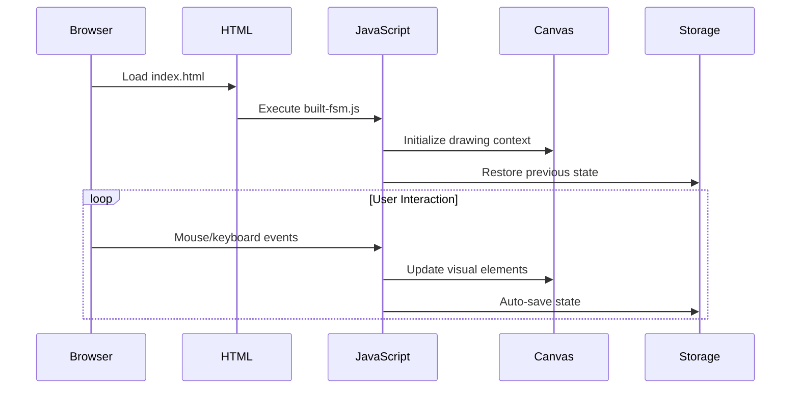
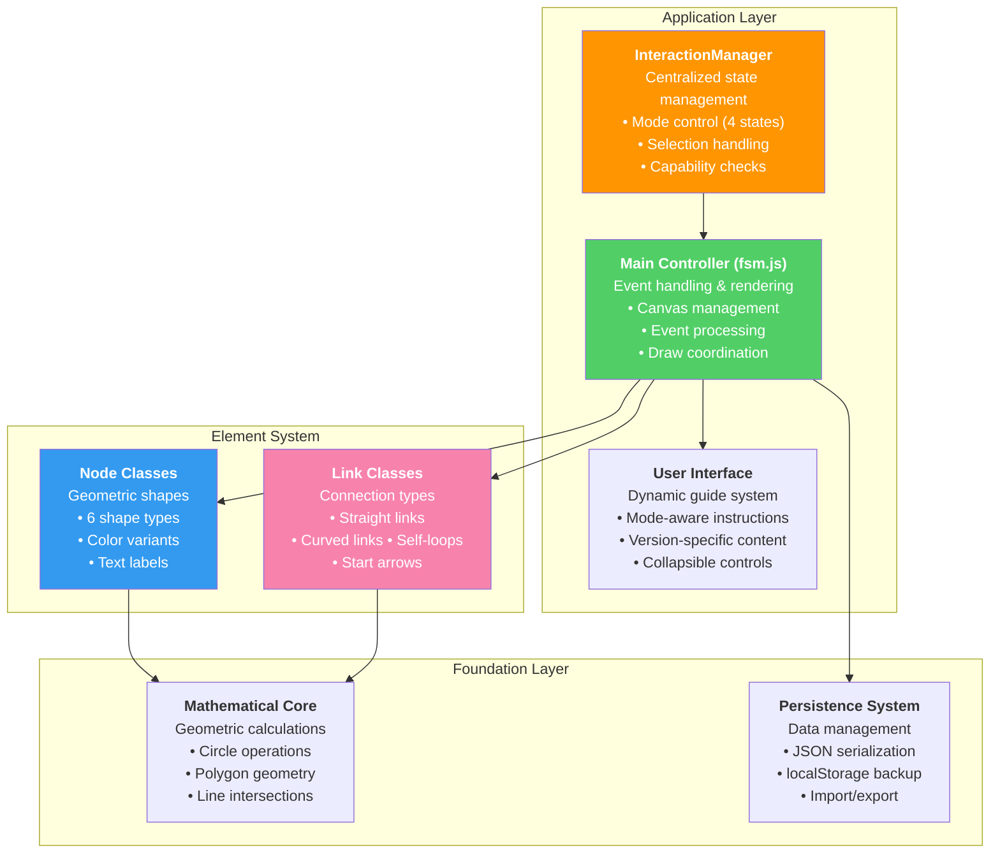
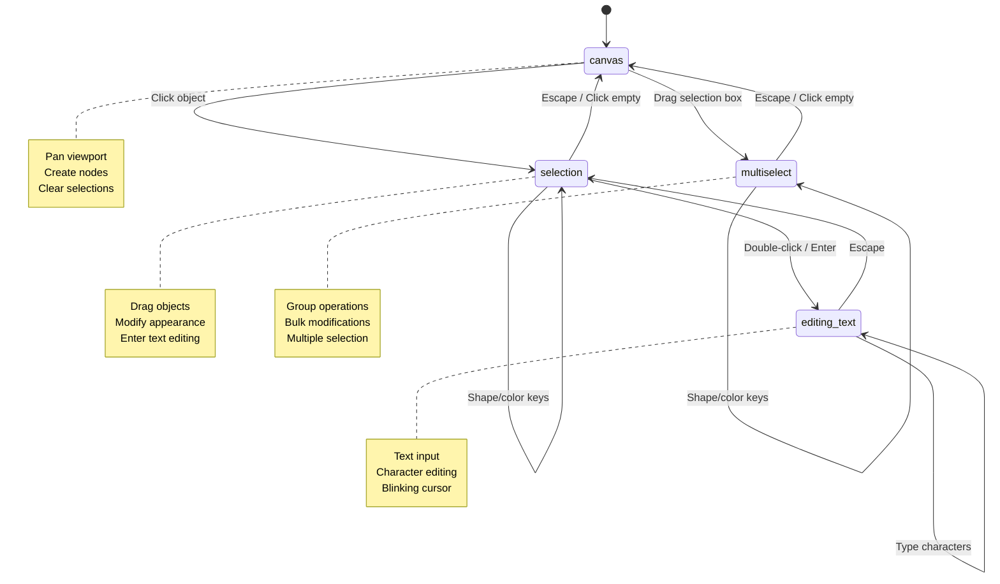
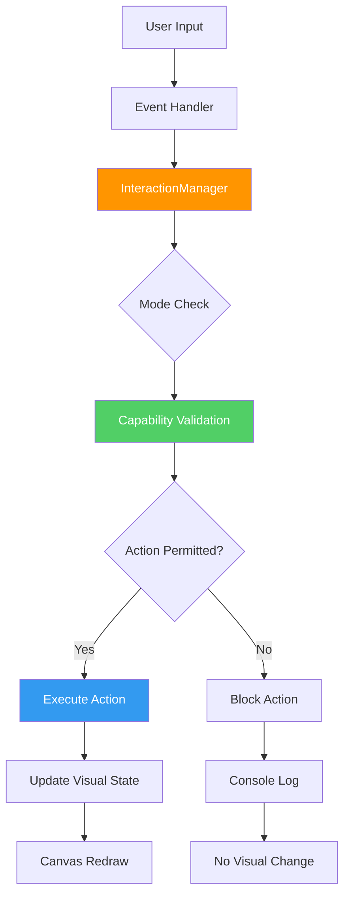

# Network Sketchpad - Architecture Context Summary
*Current State: October 15, 2025*

## Table of Contents

1. [Project Overview](#project-overview)
2. [System Architecture](#system-architecture)
3. [Core Components](#core-components)
4. [Interaction System](#interaction-system)
5. [Implementation Details](#implementation-details)
6. [Technical Infrastructure](#technical-infrastructure)
7. [Development & Extension](#development--extension)

## Project Overview

### Core Concept
Network Sketchpad is a client-side finite state machine (FSM) designer built entirely in vanilla JavaScript and HTML5 Canvas. The application runs completely in the browser without external dependencies, providing an interactive drawing environment for creating state diagrams with nodes and transitions.

### Current Capabilities
- **Node Creation**: 6 geometric shapes (dot, triangle, square, pentagon, hexagon) with 7 color options
- **Edge System**: Shape-aware connections for straight links, curved links, self-loops, and start arrows
- **Multi-Selection**: Box selection and group operations on multiple nodes
- **Interaction Modes**: Four distinct interaction states with keyboard navigation
- **Persistence**: JSON-based save/load with localStorage backup
- **Viewport**: Canvas panning with middle-mouse drag
- **Text Editing**: LaTeX shortcuts and real-time text input on nodes and edges

### Browser Execution Model


## System Architecture

### High-Level Component Structure


### File Organization
```
src/
├── main/
│   ├── fsm.js          # Main application controller
│   ├── math.js         # Geometric calculations
│   └── save.js         # Persistence system
└── elements/
    ├── node.js         # Node implementation
    ├── link.js         # Straight/curved links
    ├── self_link.js    # Self-loop links
    ├── start_link.js   # Entry point arrows
    └── temporary_link.js # Drag preview
```

## Core Components

### InteractionManager
The central state management system that controls user interaction modes and object selection.

```javascript
window.InteractionManager = {
    // Core state
    _selectedObject: null,
    _mode: 'canvas', // 'canvas', 'selection', 'editing_text', 'multiselect'
    
    // API methods
    getSelected: function() { return this._selectedObject; },
    getMode: function() { return this._mode; },
    setSelected: function(obj) { /* mode transition logic */ },
    
    // Capability checks
    canEditText: function() { /* mode-based permissions */ },
    canChangeNodeAppearance: function() { /* mode-based permissions */ },
    canDrag: function() { /* mode-based permissions */ },
    
    // Mode transitions
    enterCanvasMode: function() { /* transition logic */ },
    enterSelectionMode: function(obj) { /* transition logic */ },
    enterEditingMode: function(obj) { /* transition logic */ },
    enterMultiselectMode: function() { /* transition logic */ }
};
```

### Node System
Geometric shapes that serve as FSM states, with shape-aware boundary detection for precise edge connections.

**Supported Shapes:**
- **Dot (Circle)**: Traditional circular nodes
- **Triangle**: Three-sided polygon
- **Square**: Four-sided rectangle
- **Pentagon**: Five-sided regular polygon
- **Hexagon**: Six-sided regular polygon

**Color System:**
- 7 base colors: yellow, green, blue, pink, white, orange, gray
- Selection variants: brighter versions for visual feedback

**Core Methods:**
```javascript
Node.prototype.draw = function(c) {
    // Shape-specific rendering
    switch(this.shape) {
        case 'dot': this.drawCircle(c); break;
        case 'triangle': this.drawTriangle(c); break;
        // ... other shapes
    }
};

Node.prototype.containsPoint = function(x, y) {
    // Shape-specific hit detection
};

Node.prototype.closestPointOnShapeToEdgeArc = function(x, y) {
    // Shape-aware edge connection points
};
```

### Link System
Connection elements that represent FSM transitions, with intelligent routing around node geometries.

**Link Types:**
- **Link**: Straight or curved connections between nodes
- **SelfLink**: Loop connections from a node to itself
- **StartLink**: Entry arrows pointing to initial states
- **TemporaryLink**: Visual feedback during link creation

**Edge Connection Algorithm:**
```javascript
// Links use shape-aware connection points
Link.prototype.getEndPointsAndArcParams = function() {
    var startPoint = this.nodeA.closestPointOnShapeToEdgeArc(/* target */);
    var endPoint = this.nodeB.closestPointOnShapeToEdgeArc(/* source */);
    // Calculate arc parameters for smooth curves
};
```

## Interaction System

### Four-State Mode System
The application operates in one of four distinct interaction modes, each with specific capabilities.



### Keyboard Interface
**Navigation:**
- **Escape**: Step back through modes (editing → selection → canvas)
- **Enter**: Advance to text editing mode (selection → editing)

**Node Modification:**
- **Shape Keys**: 1, 3, 4, 5, 6 (dot, triangle, square, pentagon, hexagon)
- **Color Keys**: Q, W, E, R, T (yellow, green, blue, pink, white)

**Creation:**
- **Double-click + modifiers**: Create node with specific shape/color
- **Shift + drag**: Create transitions between nodes

### Mouse Interface
**Selection:**
- **Single click**: Select individual objects
- **Drag rectangle**: Multi-select nodes
- **Click empty space**: Clear selections

**Manipulation:**
- **Drag objects**: Move selected items
- **Double-click objects**: Enter text editing mode
- **Middle-mouse drag**: Pan viewport

## Implementation Details

### Event Processing Pipeline


### Capability System
Actions are permitted based on current interaction mode and context:

```javascript
// Example capability checks
canEditText: function() {
    return this._mode === 'editing_text' && 
           this._selectedObject && 
           'text' in this._selectedObject;
},

canChangeNodeAppearance: function() {
    return (this._mode === 'selection' && this._selectedObject instanceof Node) ||
           (this._mode === 'multiselect' && selectedNodes.length > 0);
}
```

### Compatibility Layer
Legacy code continues to work through property descriptors:

```javascript
Object.defineProperty(this, 'selectedObject', {
    get: function() { return window.InteractionManager.getSelected(); },
    set: function(value) { window.InteractionManager.setSelected(value); }
});

// Legacy patterns still work:
// selectedObject = someNode;
// if (selectedObject) { ... }
```

### Shape-Aware Geometry
Polygon nodes use sophisticated boundary detection for accurate edge connections:

```javascript
Node.prototype.closestPointOnPolygon = function(x, y) {
    // Generate polygon vertices
    var vertices = this.getPolygonVertices();
    
    // Find closest point on polygon perimeter
    return this.closestPointOnPolygonEdges(vertices, x, y);
};

Node.prototype.closestPointOnPolygonEdges = function(vertices, x, y) {
    // Iterate through polygon edges
    // Find closest point on each edge using line segment math
    // Return the globally closest point
};
```

## Technical Infrastructure

### Build System
Python-based concatenation of source files:

```python
def build():
    sources = [
        'src/_license.js',
        'src/main/fsm.js',
        'src/main/math.js', 
        'src/main/save.js',
        'src/elements/node.js',
        'src/elements/link.js',
        'src/elements/self_link.js',
        'src/elements/start_link.js',
        'src/elements/temporary_link.js'
    ]
    
    # Concatenate all source files
    data = '\n'.join(open(file, 'r').read() for file in sources)
    
    # Write to www/built-fsm.js
    with open('./www/built-fsm.js', 'w') as f:
        f.write(data)
```

### Persistence System
**Auto-save**: Continuous backup to localStorage on every change
**Export**: JSON format with complete state serialization
**Import**: File upload with backward compatibility

```javascript
// JSON structure
{
    "version": "1.0",
    "created": "2025-10-15T...",
    "nodes": [
        {
            "id": 0,
            "x": 100, "y": 200,
            "text": "Start",
            "shape": "dot",
            "color": "yellow"
        }
    ],
    "links": [
        {
            "type": "Link",
            "nodeA": 0, "nodeB": 1,
            "text": "transition"
        }
    ]
}
```

### Dynamic User Interface
The guide system adapts content based on the interaction system version:

```javascript
function populateGuide() {
    var html = '';
    
    if (ui_flow_v2) {
        // Modern interaction instructions
        html += '<li><b>Select object:</b> single click</li>';
        html += '<li><b>Edit text:</b> double-click selected object OR press Enter</li>';
        html += '<li><b>Exit editing:</b> press Escape (steps back through modes)</li>';
        // ...
    } else {
        // Legacy interaction instructions  
        html += '<li><b>Edit text:</b> click object and start typing</li>';
        // ...
    }
    
    document.getElementById('guide-content').innerHTML = html;
}
```

## Development & Extension

### Current Metrics
- **Built file**: ~2,500 lines of concatenated JavaScript
- **Source files**: 9 modular components
- **Interaction modes**: 4 distinct states
- **Shape support**: 6 geometric types with full edge connectivity
- **Color system**: 7 colors with selection variants

### Development Workflow
```bash
# Local development
python3 build_fsm.py              # Build application
python3 -m http.server 8000       # Serve locally

# Debug in browser console
InteractionManager.logState()     # View current state
InteractionManager.debugInfo()    # Get structured info
```

### Extension Points

**Adding New Shapes:**
```javascript
// 1. Add shape rendering
Node.prototype.drawNewShape = function(c) {
    // Custom drawing logic
};

// 2. Add hit detection
Node.prototype.pointInNewShape = function(x, y) {
    // Custom geometry check
};

// 3. Add edge connection
Node.prototype.closestPointOnNewShape = function(x, y) {
    // Custom boundary detection
};

// 4. Update shape modifier mapping
function getShapeFromModifier(modifier) {
    // Add new case
}
```

**Adding New Interaction Modes:**
```javascript
// 1. Add mode to InteractionManager
enterNewMode: function(context) {
    this._mode = 'new_mode';
    // Mode-specific setup
},

// 2. Add capability checks
canDoNewAction: function() {
    return this._mode === 'new_mode' && /* conditions */;
},

// 3. Add keyboard/mouse handlers
// 4. Update mode transition logic
```

**Enhancing Link Types:**
```javascript
// Follow existing pattern in link classes
function NewLinkType(nodeA, nodeB) {
    // Constructor
}

NewLinkType.prototype.draw = function(c) {
    // Custom rendering
};

NewLinkType.prototype.containsPoint = function(x, y) {
    // Hit detection
};
```

### Quality Assurance
**Testing Areas:**
- Mode transitions and capability boundaries
- Shape rendering and edge connections
- Multi-selection operations
- JSON serialization/deserialization
- Backward compatibility with legacy code
- Keyboard shortcuts and visual feedback

**Performance Considerations:**
- Canvas redraw optimization
- Event handler efficiency
- Large diagram handling (100+ nodes)
- Memory usage with complex selections

This architecture provides a solid foundation for FSM diagram creation with sophisticated interaction patterns, comprehensive shape support, and extensible design patterns. The modular structure enables both maintenance and enhancement while the capability-based interaction system ensures intuitive user experience.