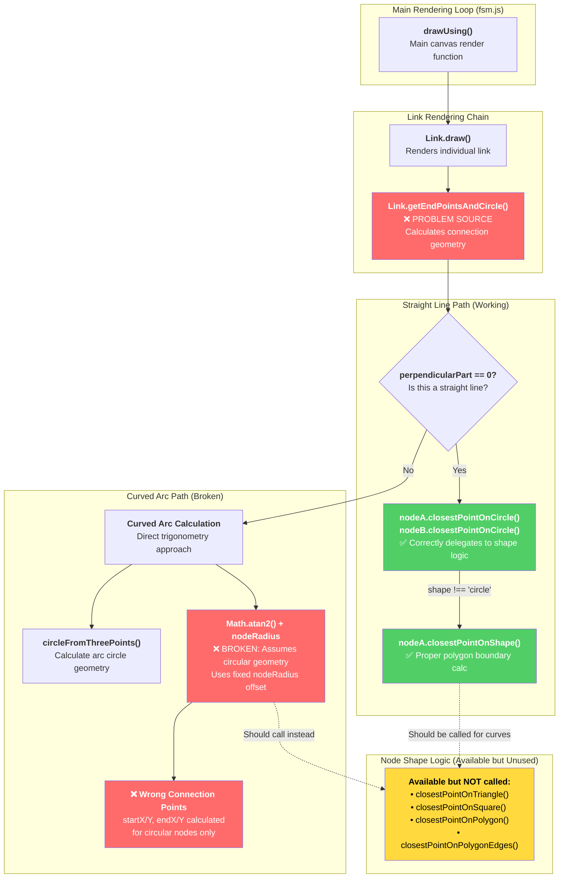

# Edge Misbehavior Diagnosis
*Analysis Date: October 12, 2025*
*Issue: Edges connecting non-circular nodes don't touch polygon boundaries*

## Problem Summary

The Network Sketchpad FSM editor exhibits incorrect behavior when connecting non-circular nodes (triangles, squares, pentagons, hexagons) with edges. The edges start and end at positions calculated as if the nodes were circles, rather than properly connecting to the actual polygon boundaries. This results in floating edges that don't visually connect to their target nodes.

**Visual Evidence:**
- Edges to/from polygon nodes appear to terminate in mid-air
- Connection points are calculated using circular geometry even for non-circular shapes
- The gap between edge endpoints and actual polygon boundaries varies depending on the polygon shape and orientation

## Root Cause Analysis

### Primary Issue: Dual Implementation with Inconsistent Usage

The Node class contains **two different connection point calculation methods**:

1. **`closestPointOnCircle(x, y)`** - Legacy circular method (lines 159-168 in node.js)
2. **`closestPointOnShape(x, y)`** - Enhanced polygon-aware method (lines 171-201 in node.js)

However, the Link class's `getEndPointsAndCircle()` method **only calls the legacy `closestPointOnCircle()` method** in both straight line and curved arc calculations.

### Specific Code Problems

#### 1. Straight Line Connections (Link.js lines 102-103)
```javascript
if(this.perpendicularPart == 0) {
    var midX = (this.nodeA.x + this.nodeB.x) / 2;
    var midY = (this.nodeA.y + this.nodeB.y) / 2;
    var start = this.nodeA.closestPointOnCircle(midX, midY);  // ❌ WRONG METHOD
    var end = this.nodeB.closestPointOnCircle(midX, midY);    // ❌ WRONG METHOD
    // ...
}
```

#### 2. Curved Arc Connections (Link.js lines 116-117)
```javascript
var startAngle = Math.atan2(this.nodeA.y - circle.y, this.nodeA.x - circle.x) - reverseScale * nodeRadius / circle.radius;
var endAngle = Math.atan2(this.nodeB.y - circle.y, this.nodeB.x - circle.x) + reverseScale * nodeRadius / circle.radius;
// ❌ WRONG: Uses circular trigonometry instead of calling shape-aware methods
```

### Architecture Inconsistency

The Node class correctly implements shape-aware connection logic:

```javascript
Node.prototype.closestPointOnCircle = function(x, y) {
    if(this.shape === 'circle') {
        // Original circular logic
        var dx = x - this.x;
        var dy = y - this.y;
        var scale = Math.sqrt(dx * dx + dy * dy);
        return {
            'x': this.x + dx * nodeRadius / scale,
            'y': this.y + dy * nodeRadius / scale,
        };
    } else {
        // ✅ CORRECT: Delegates to polygon logic
        return this.closestPointOnShape(x, y);
    }
};
```

**But the Link class bypasses this correct implementation** and uses direct circular calculations for curved arcs.

### Impact on Different Link Types

1. **Link (state transitions)**: ❌ Affected in both straight and curved modes
2. **SelfLink (self-loops)**: ❌ Likely affected (uses circular geometry assumptions)
3. **StartLink (entry arrows)**: ❌ Likely affected (uses circular geometry assumptions)
4. **TemporaryLink (drag preview)**: ❌ Likely affected (inherits from same pattern)

### Why This Wasn't Caught Earlier

1. **Original design assumption**: All nodes were circles, so the issue didn't exist
2. **Polygon shapes added later**: The enhancement added polygon drawing and hit detection, but didn't update all link calculation code paths
3. **Partial fix**: The `closestPointOnCircle()` method was updated to delegate to shape-aware logic for straight lines, but curved arc calculations still use direct trigonometry
4. **Visual testing gap**: The issue is most obvious with triangles and squares where the gap is significant

### Solution Requirements

The fix requires updating **all link classes** to use the shape-aware connection methods consistently:

1. **Straight line links**: Already partially fixed via `closestPointOnCircle()` delegation
2. **Curved arc links**: Need to replace direct trigonometric calculations with calls to `node.closestPointOnShape()`
3. **Self-links**: Need to use shape-aware boundary detection
4. **Start links**: Need to use shape-aware boundary detection

### Function Call Stack Analysis

The following diagram shows how the edge misbehavior occurs through the function call stack:



### Call Stack Breakdown

#### **Working Path (Straight Lines)**
1. `drawUsing()` → `Link.draw()` → `Link.getEndPointsAndCircle()`
2. **Branch**: `perpendicularPart == 0` (straight line)
3. **Correct**: Calls `nodeA.closestPointOnCircle(midX, midY)`
4. **Delegation**: `closestPointOnCircle()` detects `shape !== 'circle'`
5. **Success**: Calls `closestPointOnShape()` → proper polygon methods

#### **Broken Path (Curved Arcs)**
1. `drawUsing()` → `Link.draw()` → `Link.getEndPointsAndCircle()`
2. **Branch**: `perpendicularPart != 0` (curved arc)
3. **Problem**: Direct trigonometric calculation:
   ```javascript
   var startAngle = Math.atan2(this.nodeA.y - circle.y, this.nodeA.x - circle.x) 
                    - reverseScale * nodeRadius / circle.radius;
   ```
4. **Wrong**: Uses fixed `nodeRadius` assuming circular boundary
5. **Bypass**: Never calls any Node shape-aware methods

#### **The Fix Location**
The issue occurs in `Link.getEndPointsAndCircle()` lines 116-121, where curved arc calculations bypass the Node class's shape-aware connection methods entirely.

### Technical Complexity

The curved arc case is more complex because:
- The current code calculates connection points using circle center and radius
- Polygon shapes require finding intersection points between the arc and polygon edges
- This may require additional geometric utility functions for arc-polygon intersection

This diagnosis reveals that the polygon shape enhancement was incomplete - while visual rendering and hit detection were updated, the fundamental link connection geometry was not fully converted from circular to shape-aware calculations.